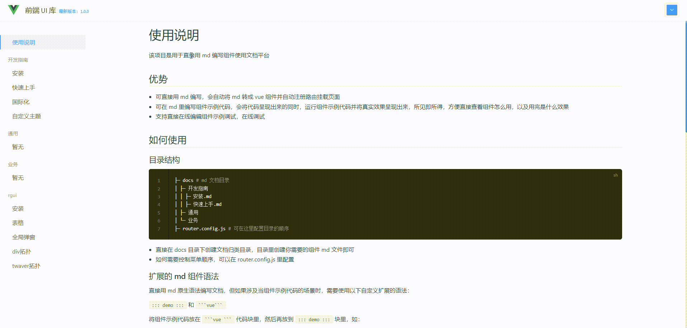
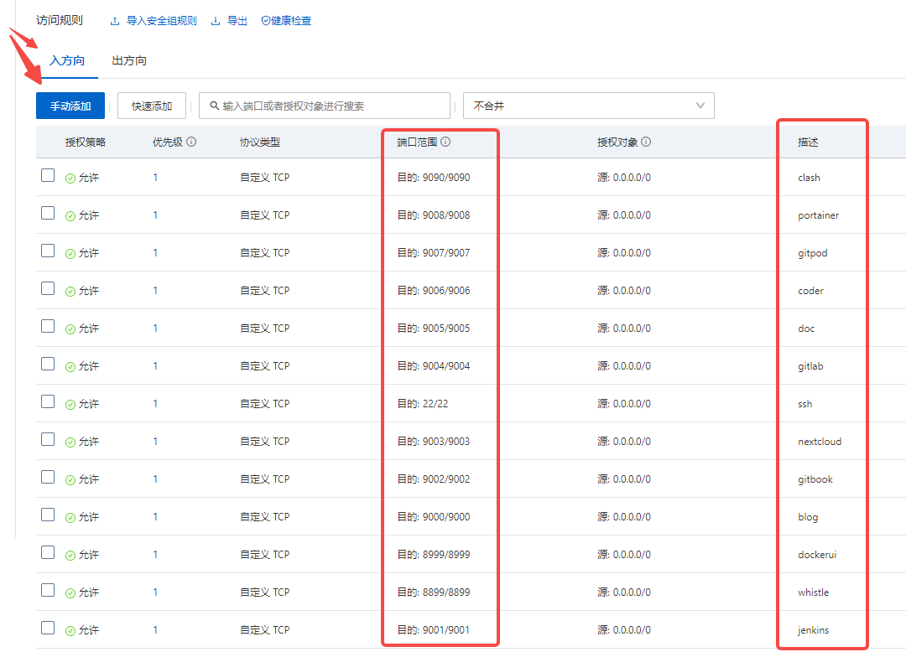

# 一键式自动给个人云服务搭建常用平台

## 背景

有时兴致来了就喜欢瞎鼓捣，几年前还是学生时买过学生优惠的云服务器，但没钱续费关停后就不了了之，近期看到有活动又重新入手了
但问题就来了，之前好不容易搭建上去的各种服务，现在又得重新来一遍
几年前还是学生时可能对这类环境搭建还比较感兴趣
现在人老了，精力不够了，做啥都考虑效率问题
如果几年后又重新买了，岂不是又得重新来一遍？

所以啊，还是得搞个一键式操作，来把这类基础、重复且低效的准备工作改造成自动化

## 诉求

覆盖我日常使用的服务有：

- 个人博客、笔记平台
  - 方便维护、查阅我过往积累的博客和笔记
- NextCloud
  - 个人云网盘，也支持在线文档编辑、查阅（如在线 office）
- UI 组件使用说明平台
  - 方便我查阅过往封装的通用 UI 组件的使用文档
- Jenkins
  - 方便我自动化管理各个云服务




那么，该怎么做呢？

## 准备工作

如果是第一次搞，那么还是有些准备工作，就绪后，随便在一台新的云服务执行下自动化脚本完事

### 1. 资料、代码都上 github

- 把博客笔记平台的各个 md 文档、图片资源等都存放到 github 管理
- 把组件使用平台的项目代码也 github 管理
- 把创建 docker 的相关配置文件也 github 管理

既然要方便一键式部署，就把各种资料都存储到网上，免费且稳定的应该就是 github 了，这样后续就可以写个自动化脚本去自动拉取各个资料了

### 2. 编写 docker-compose.yml 和各服务的 Dockerfile

各个云服务通过 docker 来部署，环境搭建就可以做到一份配置，到处部署的效果了。

#### 目录结构说明

```sh
├─ doc # 博客、笔记平台，用 nginx 做容器
│ ├─ Dockerfile
│ ├─ nginx.conf
├─ jenkins # jenkins 平台，预置好 node, pnpm 等环境
│ ├─ Dockerfile
├─ nginx # 监听默认端口（80，443），根据二级域名做反向代理
│ ├─ Dockerfile
│ ├─ nginx.conf
├─ uidoc # 组件库使用说明平台，用 nginx 做容器
│ ├─ Dockerfile
│ ├─ nginx.conf
├─ docker-compose.yml # 上述容器的统一管理、通信配置
```

#### jenkins 容器的 Dokcerfile

```dockerfile
# 使用基于 Debian 的 Jenkins 镜像作为基础
FROM jenkins/jenkins:lts

# 切换到 root 用户
USER root

# 安装 Node.js
RUN curl -fsSL https://deb.nodesource.com/setup_lts.x | bash -
RUN apt-get install -y nodejs

# 安装 pnpm
RUN npm install -g pnpm

# 安装 yarn
RUN npm install -g yarn

# 切换回 Jenkins 用户
USER jenkins

EXPOSE 8080
```

#### nginx 容器的反向代理配置

```
server {
    listen  80;
    listen [::]:80;
    server_name *.dasu.fun;
    client_max_body_size 1024M;

    location / {
      # 正则匹配二级域名，并赋值给变量 $domain
      if ($http_host ~* "^(.*?)\.dasu\.fun$") {
        set $domain $1;
      }
      # 根据二级域名，做反向代理转发
      if ($domain ~* "jenkins") {
        proxy_pass http://192.168.5.104:8080;
      }
      if ($domain ~* "blog") {
        proxy_pass http://192.168.5.105;
      }
      if ($domain ~* "uidoc") {
        proxy_pass http://192.168.5.106;
      }
      if ($domain ~* "nextcloud") {
        proxy_pass http://192.168.5.108;
      }
      if ($domain ~* "doc") {
        proxy_pass http://192.168.5.110;
      }
      proxy_set_header Host	$host;
      proxy_set_header X-Real-IP	$remote_addr;
      proxy_set_header X-Forwarded-For $proxy_add_x_forwarded_for;

      proxy_pass http://192.168.5.110;
    }
}

```

#### docker-compose.yml 配置

```yml
version: "3"

services:
  nginx:
    build: ./nginx/ # 使用位于 ./nginx/ 目录中的 Dockerfile 来构建容器镜像
    ports:
      - "80:80" # 将容器的 80 端口映射到主机的 80 端口
    restart: always # 容器停止后自动重启
    networks:
      n_nginx:
        ipv4_address: 192.168.5.103 # 为容器分配指定的 IPv4 地址

  jenkins:
    build: ./jenkins/ # 使用位于 ./jenkins/ 目录中的 Dockerfile 来构建容器镜像
    ports:
      - "9001:8080" # 将容器的 8080 端口映射到主机的 9001 端口
      - "50000:50000" # 将容器的 50000 端口映射到主机的 50000 端口
    user: root # 在容器中以 root 用户身份运行
    restart: always # 容器停止后自动重启
    volumes:
      - /root/Doc/:/var/jenkins_home/doc/codes/ # 将主机的 /root/Doc/ 目录挂载到容器的 /var/jenkins_home/doc/codes/ 目录
      - /root/uidoc/:/var/jenkins_home/uidoc/codes/
      - /root/.ssh/:/root/.ssh/:ro # 将主机的 /root/.ssh/ 目录挂载到容器的 /root/.ssh/ 目录，并设置为只读
      - /etc/localtime:/etc/localtime:ro # 将主机的 /etc/localtime 文件挂载到容器的 /etc/localtime 文件，并设置为只读
    networks:
      n_nginx:
        ipv4_address: 192.168.5.104 # 为容器分配指定的 IPv4 地址

  uidoc:
    build: ./uidoc/ # 使用位于 ./uidoc/ 目录中的 Dockerfile 来构建容器镜像
    ports:
      - "9002:80" # 将容器的 80 端口映射到主机的 9002 端口
    restart: always # 容器停止后自动重启
    volumes:
      - /root/uidoc/dist/:/usr/share/nginx/html/
    networks:
      n_nginx:
        ipv4_address: 192.168.5.106 # 为容器分配指定的 IPv4 地址

  db:
    image: postgres # 使用 PostgreSQL 镜像
    restart: always # 容器停止后自动重启
    environment:
      - POSTGRES_PASSWORD=222zaqXSW! # 设置 PostgreSQL 数据库的密码
      - POSTGRES_USER=postgres # 设置 PostgreSQL 数据库的用户名
    volumes:
      - /root/postgres/data:/var/lib/postgresql/data # 将主机的 /root/postgres/data 目录挂载到容器的 /var/lib/postgresql/data 目录
    expose:
      - "5432" # 暴露容器的 5432 端口给其他容器使用
    networks:
      n_nginx:
        ipv4_address: 192.168.5.107 # 为容器分配指定的 IPv4 地址

  nextcloud:
    image: nextcloud # 使用 Nextcloud 镜像
    restart: always # 容器停止后自动重启
    ports:
      - 9003:80 # 将容器的 80 端口映射到主机的 9003 端口
    depends_on:
      - db # 依赖于 db 服务，确保数据库服务在 Nextcloud 服务启动之前已经启动
    environment:
      - POSTGRES_HOST=db # 设置 Nextcloud 使用的 PostgreSQL 数据库的主机为 db
      - POSTGRES_DB=postgres # 设置 Nextcloud 使用的数据库名称
      - POSTGRES_USER=postgres # 设置 Nextcloud 使用的数据库用户名
      - POSTGRES_PASSWORD=222zaqXSW! # 设置 Nextcloud 使用的数据库密码
    volumes:
      - nextcloud:/var/www/html # 将名为 "nextcloud" 的卷挂载到容器的 /var/www/html 目录
    networks:
      n_nginx:
        ipv4_address: 192.168.5.108 # 为容器分配指定的 IPv4 地址

  doc:
    build: ./doc/
    ports:
      - "9005:80"
    restart: always
    volumes:
      - /root/Doc/dist/:/usr/share/nginx/html/
    networks:
      n_nginx:
        ipv4_address: 192.168.5.110 # 为容器分配指定的 IPv4 地址

networks:
  n_nginx:
    driver: bridge # 使用桥接网络模式
    ipam:
      config:
        - subnet: 192.168.5.0/24 # 定义网络的子网地址范围为 192.168.5.0/24，宿主机一般会是该网段的 .1，所以不要将网段设置为 1

# 命名卷是多容器共享卷，具有持久化能力
volumes:
  nextcloud:
```

### 3. 购买域名、备案和配置 DNS 解析

购买和备案自行参考域名购买的平台指引
由于我使用到多个云服务，而且是通过二级域名来区分，因此需要配置下各个二级域名的解析，如：

| 主机记录（二级域名） | 记录值（云服务器 IP） |
| -------------------- | --------------------- |
| uidoc                | 59.110.12.xx          |
| doc                  | 59.110.12.xx          |
| netcloud             | 59.110.12.xx          |
| jenkins              | 59.110.12.xx          |
| blog                 | 59.110.12.xx          |
| www                  | 59.110.12.xx          |

### 4. 云服务器放开入端口

如果没有购买域名，或者需要直接用 ip+port 访问不同服务，那么需要放开对应的端口，以阿里云为例，在域名控制台-安全组-访问规则-入方向里配置：



## 自动化脚本一键式部署

### 1. 云服务生成 ssh

由于所有的资料都传到 github 上了，因此需要先把云服务器的 ssh 配置到 github 上，以便服务器有权限拉取 github 项目

- `ssh-keygen -t rsa -b 4096 -C "xxx@qq.com"`
- `cat .ssh/id_rsa.pub`
- 将第二步输出的公钥复制到 github 的 ssh 配置

### 2. 在服务器上执行脚本

```bash
cat << 'EOF' > setup.sh

#!/bin/bash

# 函数：打印日志
log() {
  echo '>>>>>>>>>>>>>>>>>>>>>>>>>>>>>>>>>>>>>>>>>>>>>>>>>>>>>>>>>>>>>>>>>>>>>>>>>>>>>>>'
  echo "$1"
}

# 更新软件库
sudo yum update -y
# 安装 Docker 环境
log "开始安装 Docker 环境..."
sudo yum install -y yum-utils device-mapper-persistent-data lvm2
sudo yum-config-manager --add-repo https://download.docker.com/linux/centos/docker-ce.repo
sudo yum install -y docker-ce docker-ce-cli containerd.io
sudo cp /etc/docker/daemon.json /etc/docker/daemon.json.bak
sudo systemctl start docker
sudo usermod -aG docker $USER
docker -v
log "Docker 环境安装完成。"

# 安装 Docker Compose 环境
log "开始安装 Docker Compose 环境..."
sudo curl -L "https://github.com/docker/compose/releases/latest/download/docker-compose-$(uname -s)-$(uname -m)" -o /usr/local/bin/docker-compose
sudo chmod +x /usr/local/bin/docker-compose
docker-compose --version
log "Docker Compose 环境安装完成。"
docker-compose --version

# 安装 Git 环境
log "开始安装 Git 环境..."
sudo yum install -y git
log "Git 环境安装完成。"
git --version

# 安装 nvm 和 Node.js 环境
log "开始安装 nvm 和 Node.js 环境..."
curl -o- https://gitee.com/mirrors/nvm/raw/v0.39.0/install.sh | bash
source ~/.bashrc
nvm --version
nvm install --lts
npm config set registry https://registry.npm.taobao.org
log "nvm 和 Node.js 环境安装完成。"
node -v

# 安装 Whistle 环境
log "开始安装 Whistle 环境..."
npm install whistle -g
log "Whistle 环境安装完成。"
#w2 start

# 安装 pnpm
log "开始 pnpm..."
npm install -g pnpm
pnpm -v

# 安装 yarn
log "开始 yarn..."
npm install -g yarn
yarn -v


# 拉取 github 仓库
log "拉取 github 仓库..."

cd /root/
mkdir blog
mkdir github
mkdir postgres

echo -e "Host github.com\n  StrictHostKeyChecking no" >> ~/.ssh/config
git clone git@github.com:woshidasusu/dockers.git

cd /root/blog
git clone git@github.com:woshidasusu/woshidasusu.github.io.git

cd /root/
git clone git@github.com:woshidasusu/Doc.git
cd Doc
pnpm install
pnpm run build


cd /root/
git clone git@github.com:woshidasusu/uidoc.git
cd uidoc
npm install
npm run build


log "所有环境安装完成。"
docker -v
docker-compose --version
node -v


EOF

```

- 执行后，会在当前目录下生成一份 setup.sh 文件，继续执行：
- `chmod +x setup.sh`
  - 将文件设置成可执行
- `bash setup.sh`
  - 执行脚本

脚本会自动去安装 docker, docker-compose, git, nvm, node, whistle 以及拉取 github 的项目
注：有些下载源是 github 的可能会失败，如果失败了需要手动执行，通常是 docker-compose 和 nvm 可能出现安装失败

### docker-compose up -d

进入上述脚本下载的 dockers 目录，在该目录执行：

- `docker-compose up -d`

执行结束后，各服务容器就会创建并运行起来了，这时候浏览器访问相关服务试试看就完事了

---

搞完这些后，我可以随便格式化云盘，每次重新搭时，先配置个 ssh，再执行下脚本，服务就都自动搭建完毕，舒服~
