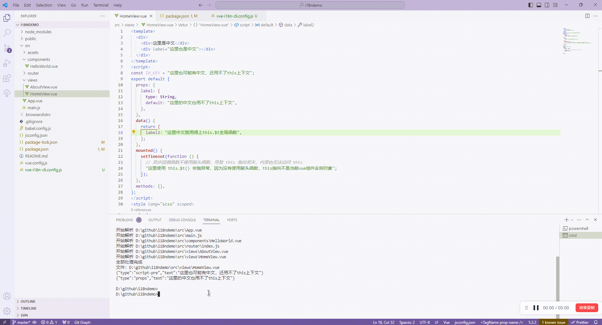
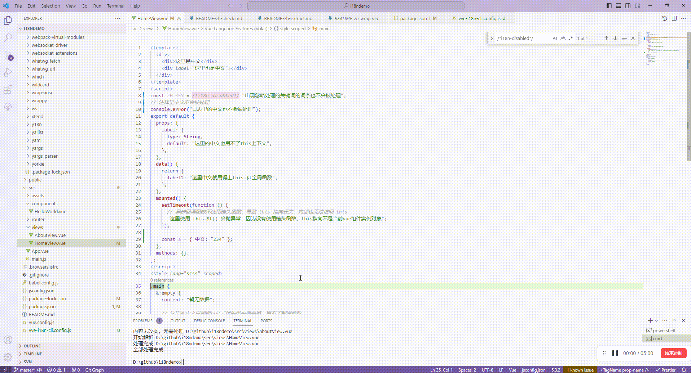
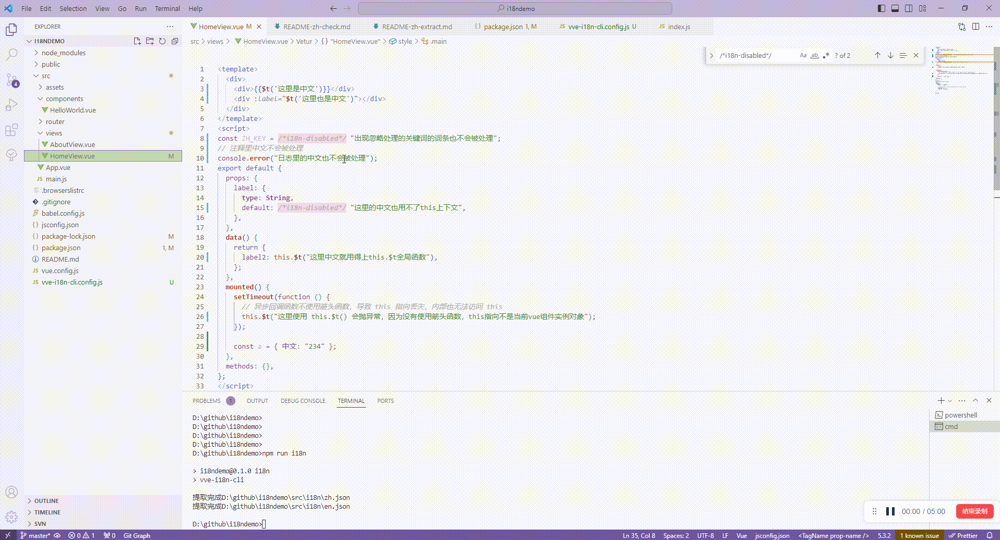

# 使用 vve-i18n-cli 来一键式自动化实现国际化

[【Github：vue-viewer-editor/vve-i18n-cli】](https://github.com/vue-viewer-editor/vve-i18n-cli)

这是我同事开发的国际化自动处理脚本，我进行过一次扩展，让其也支持我们一个 jQuery 老项目的国际化日常维护

至此，我们团队内的国际化均是使用该脚本来进行日常维护

该自动化脚本极大的为我们提效，基本将国际化的词条相关工作降低到 0 了，这意味着我们基本上不用特意留出太多时间来处理国际化方面的工作

但是，国际化其实不只有词条相关的工作，至于还有哪些工作，我之前发表过一篇[《项目国际化的难点痛点是什么》](https://juejin.cn/post/7319674466170093603)里面吐槽得很清晰了

不可否认的是，如果没有这个自动化脚本，根本就没法在领导期望的时间内完成国际化的工作

自从有了这个脚本后，从以前的跟领导评估说要 4 天的国际化工作量到现在只评估了 1 天工作量，实际上跑下脚本分分钟就解决了，我还可以愉快的滑一天水，领导开心，我也开心~

## 自动化脚本能力

### 检查项目里是否存在不合理的编程方式，如中文做 key 值等



上述示例命令运行结果呈现：

`{"type":"script-pre","text":"这里也可能有中文，还用不了this上下文"}`
`{"type":"props","text":"这里的中文也用不了this上下文"}`  
`{"type":"zh-key","text":"中文"}`

`script-pre` 场景是说发现有中文存在于 script 标签内，这部分代码运行在 js 模块作用域内，this 指向不是 vue 组件，包裹 `this.$t` 的话会导致程序异常，所以要先手动处理下，能下沉就下沉，否则就先手动用全局函数包裹，然后忽略这个处理

`props` 场景是说发现有中文存在于 vue 的 props 字段里，这里也无法访问 this，会报异常，建议这块更改成 computed 用法

`zh-key` 场景是说发现中文做 key 值，需要用户确认是否能被翻译处理

这个命令可以提前主动的发现代码里的国际化处理问题，避免将问题遗留到测试或线上阶段

### 标记无需处理的词条

总有些场景，你希望这个中文词条不要被国际化处理，这时候可以类似 es-lint 的忽略配置一样，既可以忽略整个文件，也可以忽略文件中的某个词条

在 `vve-i18n-cli.config.js` 里增加下忽略配置规则：

```javascript
// vve-i18n-cli.config.js
module.exports = {
  // 国际化文本包裹相关
  zhWrap: {
    // 需要过滤的文件
    ignoreI18nFileRules: [],
    // 需要处理的文件
    i18nFileRules: ["!(node_modules|config|statsvnTmp)/**/*.+(js|vue)"],
    // 当词条前缀出现以下正则时，该词条过滤不处理
    ignorePreReg: [
      /t\s*\([\s\n]*$/, //  词条在 t( 方法内的不处理，$t() 符合该规则
      /console\.(?:log|error|warn|info|debug)\s*\(\s*$/, //  词条在 console.xxx 方法内的不处理，过滤掉日志内的中文处理
      new RegExp("//.+"), // 注释中的词条不处理
      new RegExp("i18n-disabled.+"), // 词条前面出现 i18n-disabled 关键词的不处理
    ],
  },
};
```

然后代码中这些场景就不被处理了：

```javascript
const ZH_KEY = /*i18n-disabled*/ "出现忽略处理的关键词的词条也不会被处理";
// 注释里中文不会被处理
console.error("日志里的中文也不会被处理");
```

### 自动对各种场景的中文词条包裹翻译函数

当检查完代码基本没问题，也配置了需要忽略处理的词条文件后，就可以通过命令自动对中文词条进行包裹翻译函数处理了：



不管你项目文件有成百上千个，都是一个命令就自动完成国际化翻译函数包裹词条处理

包裹哪些文件、包含的翻译函数名，不同场景（js 里，vue 里）用什么函数包裹，js 里是否需要加入 import 引入包含函数的代码，哪些文件不处理，哪些词条不处理，哪些前缀标记的不处理等等

以上场景都是通过 `vve-i18n-cli.config.js` 配置文件处理，详情查看下面章节，有默认的配置，你也可以根据你项目需要进行自己诉求的配置

脚本不是写死的行为，通过不同配置，可以适应到各种项目里去使用，目前我们团队的老项目，新项目，各种项目就通过各自项目的配置来接入了这个国际化自动处理脚本

### 自动将所有词条提取到 json 文件中（按模块维护）

当项目完成的国际化包裹词条处理后，就可以接着下一步，把词条提取到 json 文件里了：



想机翻，可以，默认不翻译，只做提取  
想按模块提取到不同 json 文件里，可以，配置下模块规则  
想生成多份语言的 json，可以，默认只有 zh.json, en.json

---

国际化的词条工作无外乎就是词条包裹处理，词条提取，词条翻译

这些工作难度不大，但工作量大，借助这类国际化自动处理脚本，就可以极大的提高效率，开心的滑水了

## 如何使用

### 安装

`npm install vve-i18n-cli -D`

### package 里添加脚本命令，简化命令使用

```json
{
  "scripts": {
    "i18n": "vve-i18n-cli",
    "i18n-wrap": "vve-i18n-zh-wrap-cli",
    "i18n-check": "vve-i18n-zh-check-cli"
  }
}
```

### 根目录下创建配置文件 vve-i18n-cli.config.js

```javascript
// vve-i18n-cli.config.js
module.exports = {
  // 工作目录
  cwd: ".",
  // 根目录，国际文本所在的根目录
  rootDir: "src",
  // 默认所有模块，如果有传module参数，就只处理某个模块
  // '**/module-**/**/index.js'
  moduleIndexRules: ["."],
  // 忽略模块
  ignoreModuleIndexRules: [],
  // 匹配含有国际化文本的文件规则
  i18nFileRules: ["**/*.+(vue|js)"],
  // 不匹配含有国际化文本的文件规则
  ignoreI18nFileRules: [],
  // 国际化文本的正则表达式，正则中第一个捕获对象当做国际化文本
  i18nTextRules: [/(?:[\$.])t\([\s\n]*['"](.+?)['"]/g],
  // 模块的国际化的json文件需要被保留下的key，即使这些组件在项目中没有被引用
  // 规则可以是一个字符串，正则，或者是函数
  keepKeyRules: [
    /^G\/+/, // G/开头的会被保留
  ],
  // 忽略国际化KEY的规则
  // 规则可以是一个字符串，正则，或者是函数
  ignoreKeyRules: [],
  // 生成的国际化资源包的输出目录
  outDir: "lang",
  // 生成的国际化的语言
  i18nLanguages: [
    "zh", // 中文
    "en", // 英文
  ],
  // 配置文件的路径，没有配置，默认路径是在${cwd}/vve-i18n-cli.config.js
  config: undefined,
  // 是否取配置文件
  disableConfigFile: false,
  // 是否翻译
  translate: false,
  // 翻译的基础语言，默认是用中文翻译
  translateFromLang: "zh",
  // 是否强制翻译，即已翻译修改的内容，也重新用翻译生成
  forceTranslate: false,
  // 翻译的语言
  translateLanguage: ["zh", "en"],
  // 非中文使用拼音来来翻译
  translateUsePinYin: false,
  // 模块下${outDir}/index.js文件不存在才拷贝index.js
  copyIndex: false,
  // 是否强制拷贝最新index.js
  forceCopyIndex: false,

  // 国际化文本包裹相关
  zhWrap: {
    cwd: ".",
    // 根目录，国际文本所在的根目录
    rootDir: ".",
    ignoreI18nFileRules: [],
    i18nFileRules: ["!(node_modules|config|statsvnTmp)/**/*.+(js|vue)"],
    ignorePreReg: [
      /t\s*\([\s\n]*$/,
      /tl\s*\([\s\n]*$/,
      /console\.(?:log|error|warn|info|debug)\s*\(\s*$/,
      /\/\/\s*$/,
      new RegExp("//.+"),
      new RegExp("i18n-disabled.+"),
    ],
    ignoreText: ["^[\\u4e00-\\u9fa5a-zA-Z0-9“._=,':;*#！”-]+$"],
    // js相关文件需要引入的国际化文件
    i18nImportForJs: "",
    // js相关文件需要使用国际化方法
    jsI18nFuncName: "$i18n.$t",
    // vue相关文件需要使用的国际化方法
    vueI18nFuncName: "$t",
  },
  zhCheck: {
    cwd: ".",
    // 根目录，国际文本所在的根目录
    rootDir: ".",
    ignoreI18nFileRules: [],
    i18nFileRules: ["!(node_modules|config|statsvnTmp)/**/*.+(vue|js)"],
    // 反引号中需要忽略的文本规则，可以是正则或者字符串
    ignoreTextInQuoteRules: [/t\(/],
  },
};
```

### 先检查是否存在不合理的代码实现

`npm run i18n-check`

### 再执行自动对词条包裹翻译函数的命令

`npm run i18n-wrap`

### 最后把这些被翻译函数包裹的词条提取到 json 文件里

`npm run i18n`

---

这份脚本很通用化，根据各自配置规则，可以适应到各种项目里面，实在不行，代码也是开源的，拉下来修修改改得了

## 扩展

我们团队的翻译不是机翻，而是有专门的翻译团队进行翻译，因此提取完 json 词条后，还需要用 excel 跟翻译团队打交道

所以可以来扩展下几个脚本

### 提取未翻译词条到 excel 文件中

```javascript
/**
 * 抽取未翻译的词条到excel文件中
 */
const map = require("map-stream");
const path = require("path");
const vfs = require("vinyl-fs");
const XLSX = require("xlsx");

const ROOT_DIR = path.resolve("./");
const fileRules = [
  "**/*/i18n/en.json",
  // "**/eweb-setting-planningDeployment/i18n/en.json",
];

const writeExcel = (arr, name = "未翻译词条") => {
  const sheet_data = arr.map((v) => {
    return {
      中文: v,
      English: "",
    };
  });
  const new_sheet = XLSX.utils.json_to_sheet(sheet_data);
  // // 创新一个新的excel对象，就是workbook
  const new_workbook = XLSX.utils.book_new();
  // // 将表的内容写入workbook
  XLSX.utils.book_append_sheet(new_workbook, new_sheet, "sheet1");
  XLSX.writeFile(new_workbook, `${name}.xlsx`);
};

function run() {
  const zhList = [];
  console.log("================================>start", ROOT_DIR);
  vfs
    .src(
      fileRules.map((item) => path.resolve(ROOT_DIR, item)),
      {
        ignore: ["node_modules/**/*", "statsvnTmp/**/*"],
      }
    )
    .pipe(
      map((file, cb) => {
        console.log("处理文件 =========================>", file.path);

        let fileContent = file.contents.toString();
        fileContent = JSON.parse(fileContent);
        Object.keys(fileContent).map((zh) => {
          if (zh.match(/[\u4E00-\u9FFF]/)) {
            if (zh === fileContent[zh]) {
              // 未翻译
              zhList.push(zh);
            }
          }
        });
        cb();
      })
    )
    .on("end", () => {
      const uniZh = Array.from(new Set(zhList));
      writeExcel(uniZh);
      console.log("未翻译词条数量：", uniZh.length);
      console.log(
        "================================>end",
        "根目录下生成 excle 文件"
      );
    });
}

run();
```

### 将 excel 中的词条回填到 json 文件中

```javascript
/**
 * 将翻译后的内容替换到en.json文件中
 */
const map = require("map-stream");
const path = require("path");
const vfs = require("vinyl-fs");
const fs = require("fs");
const XLSX = require("xlsx");

const ROOT_DIR = path.resolve("./");
const fileRules = ["**/*/i18n/en.json"];
// 文件名称 默认名称 resource.json
const fileName = "resource";
const fileJsonName = fileName + ".json";
const fileXlsName = fileName + ".xlsx";

const excelReader = (exlcePathArray = []) => {
  if (!Array.isArray(exlcePathArray)) {
    exlcePathArray = [exlcePathArray];
  }
  const obj = {};
  for (const i in exlcePathArray) {
    if (Object.hasOwnProperty.call(exlcePathArray, i)) {
      const excleFilePath = exlcePathArray[i];
      console.log("读取excle " + excleFilePath);
      const workbook = XLSX.readFileSync(excleFilePath, {
        type: "binary",
      });
      for (const sheet in workbook.Sheets) {
        const dataArray = XLSX.utils.sheet_to_json(workbook.Sheets[sheet]);
        obj[sheet] = dataArray;
      }
    }
  }
  return obj;
};

// 如果未找到 resource.json 查找 excel文件
if (!fs.existsSync(path.resolve(ROOT_DIR, fileJsonName))) {
  // 判断resource.excel是否存在
  if (fs.existsSync(path.resolve(ROOT_DIR, fileXlsName))) {
    let fileObj = excelReader(path.resolve(ROOT_DIR, fileXlsName));
    let dataObj = {};
    if (fileObj.sheet1) {
      // 中文列存在 例子： {"中文":"下载中...","English":"down…"}
      for (let i = 0; i < fileObj.sheet1.length; i++) {
        let itemZhKey = fileObj.sheet1[i]["中文"];
        let itemEnKey = fileObj.sheet1[i]["English"];
        if (itemZhKey && itemEnKey) {
          dataObj[itemZhKey] = itemEnKey;
        }
      }
    }
    // 获取sheet1的内容
    const data = JSON.stringify(dataObj);
    try {
      fs.writeFileSync(path.resolve(ROOT_DIR, fileJsonName), data);
    } catch (error) {
      console.log("生成文件 resource.xlsx 异常");
      throw error;
    }
  } else {
    console.log("不存在文件 resource.xlsx");
    throw new Error("不存在文件 resource.xlsx");
  }
}

const originResource = require(path.resolve(ROOT_DIR, fileJsonName));
let resource = Object.assign({}, originResource);
Object.keys(originResource).map((key) => {
  resource[`${key}：`] = `${originResource[key]}：`;
  resource[`${key}:`] = `${originResource[key]}:`;
  resource[`${key}）`] = `${originResource[key]}）`;
  resource[`${key})`] = `${originResource[key]})`;
  resource[`${key} `] = `${originResource[key]} `;
  resource[` ${key}`] = ` ${originResource[key]}`;
  resource[`(${key}`] = `(${originResource[key]}`;
  resource[`（${key}`] = `（${originResource[key]}`;
  resource[` ${key} `] = ` ${originResource[key]} `;
});

function run() {
  console.log("================================>start", ROOT_DIR);
  let failedCount = 0;
  let successCount = 0;
  let failedZhs = [];
  vfs
    .src(
      fileRules.map((item) => path.resolve(ROOT_DIR, item)),
      {
        ignore: ["node_modules/**/*", "statsvnTmp/**/*"],
      }
    )
    .pipe(
      map((file, cb) => {
        console.log("处理文件 =========================>", file.path);

        let fileContent = file.contents.toString();
        fileContent = JSON.parse(fileContent);
        let hasChange = false;
        Object.keys(fileContent).map((zh) => {
          if (zh.match(/[\u4E00-\u9FFF]/)) {
            if (zh === fileContent[zh]) {
              // 未翻译
              if (resource[zh] && resource[zh] !== zh) {
                hasChange = true;
                fileContent[zh] = resource[zh];
                successCount++;
              } else {
                failedCount++;
                failedZhs.push(zh);
              }
            }
          }
        });
        if (hasChange) {
          fs.writeFileSync(
            file.path,
            JSON.stringify(fileContent, " ", 2) + "\n"
          );
        }
        cb();
      })
    )
    .on("end", () => {
      fs.writeFileSync(
        "unHandle.json",
        JSON.stringify(failedZhs, " ", 2) + "\n"
      );
      console.log("本次翻译成功词条数量：", successCount);
      console.log("还剩余未翻译词条数量：", failedCount);
      console.log("================================>end");
    });
}

run();
```
