# 善用 vscode 的批量和模板技巧来提效

vs code 其实有很多实用的技巧可以在日常工作中带来很大的提效，但可能是开发中没有相应的痛点场景，因此有些技巧接触的人不多

本篇就来介绍下多光标的批量操作和模板代码两种技巧在日常工作中的提效

## 涉及的 vs code 技巧

不要看快捷键好像很多哈，主要是了解几种可以进入多光标批量操作模式的用法

进入多光标之后的快捷键就是日常使用的选中、复制、粘贴了，只是以前是针对当前单个光标的操作，现在变成了针对多个光标的批量操作而已

### 如何进入多光标的批量操作模式

#### Ctrl + 鼠标左键（手动添加多个光标）

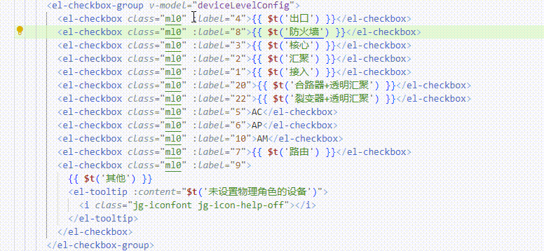

按住 `Ctrl` 键后，在哪里点击鼠标左键就会增加一个光标，在原本就有光标的位置点击鼠标左键，是取消当前这个光标

#### Ctrl + D（自动在满足匹配规则的内容处添加光标）

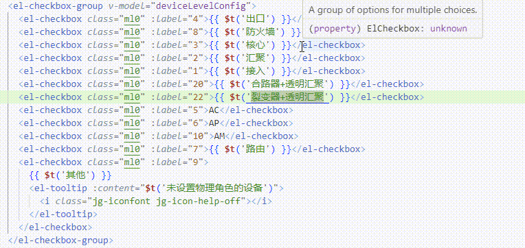

当我们选中一定内容时，vs code 其实已经将全文里面满足相同规则的内容都会给稍微呈现暗色来提示这是跟当前选中内容一样的内容

比如上图中但选中 `</el-check` 内容时，其他相同的内容颜色上明显可以看出有点暗色样式

`Ctrl + D` 就是将这些满足相同匹配规则的内容自动加上个光标，按一次往下处理一次，按一次处理一次

如果想一次性把所有满足的都加上光标处理，快捷键是 `Ctrl + Shift + L`

#### Ctrl + Shift + Alt + 上下方向键（在当前光标上一行或下一行同列的地方添加光标）

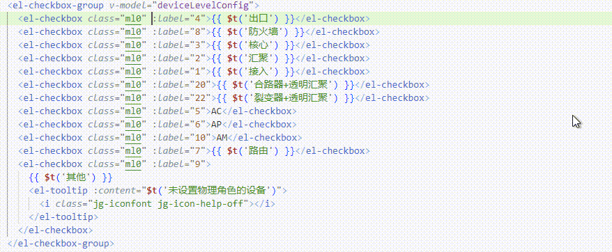

如果你要添加多光标的场景刚好的相邻行里同列的地方，那可以直接通过这个快捷键快速添加上多行的光标，就不用再鼠标左键一个个点过去了，也不用去寻找每一行的相同匹配内容了

### 多光标后的批量操作

简单说，你正常能做的操作，在多光标批量操作模式里也可以进行，区别只是变成了你的操作同时在多个光标中批量进行

所以当你有需要在当前代码文件里进行多个重复操作时，就可以考虑多光标的批量操作模式了，比如国际化场景，下面会举个实操场景

#### Shift + 左右方向键（左右移动选中单个字符）

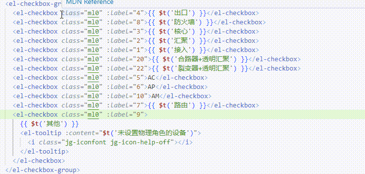

#### Shift + Ctrl + 左右方向键（左右移动选中整个单词）

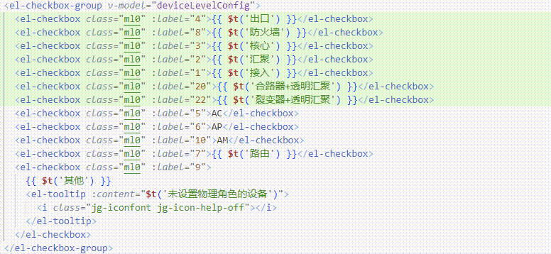

#### Shift + End（选中从当前光标到当前行末尾）

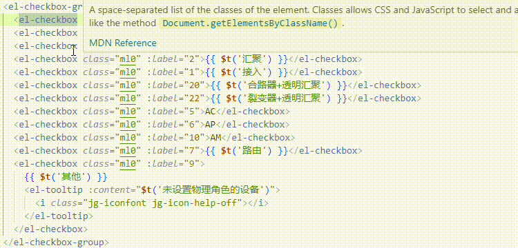

#### Shift + Home（选中从当前光标到当前行开头）

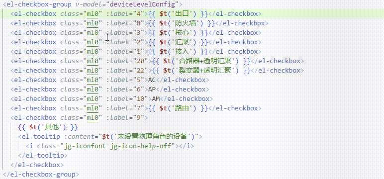

#### Ctrl + C/V（批量复制粘贴所有光标选中的内容）

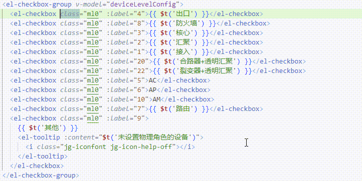

### 【User Snippets】如何配置模板代码

我们可以配置一些代码片段来自动快速生成模板代码

比如国际化工作中需要给在 template 代码里的中文词条进行 `{{ $t('xxx') }}` 处理，常规来说是不是需要先剪切词条，手动输入 `{{ $t('') }}`，最后再粘贴，如：

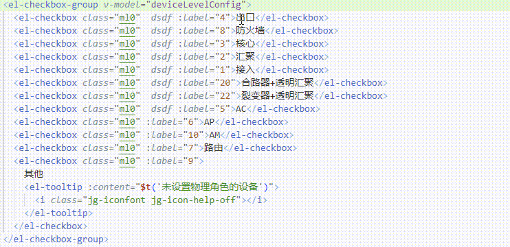

最后代码不多，但也需要敲打好几次键盘，如果用上模板代码呢。

先看下如何配置模板代码：

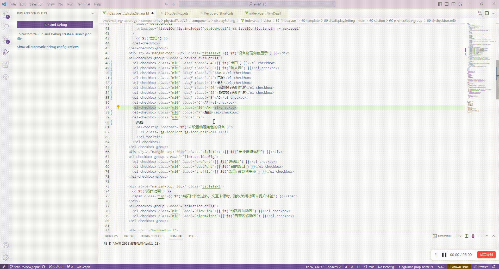

因为我已经创建过了，所以上面动图直接给你呈现模板配置代码，你要创建的话，就是 New 一个自己的模板配置，然后参考类似的模板配置

创建完后，在代码里只要输入我们配置好的代码前缀，再按 `Tab` 键，就会自动生成代码了，如：

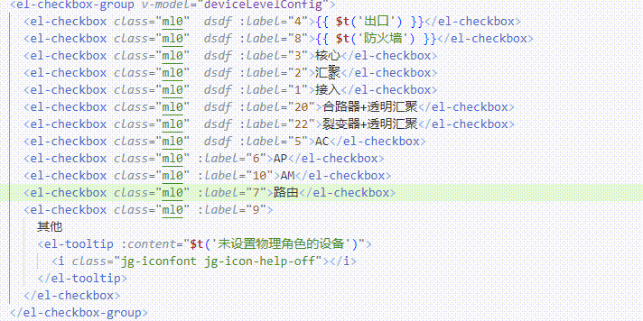

可能从上面的例子你没觉得提效多少，那假如模板代码很多呢？比如你看看这个：

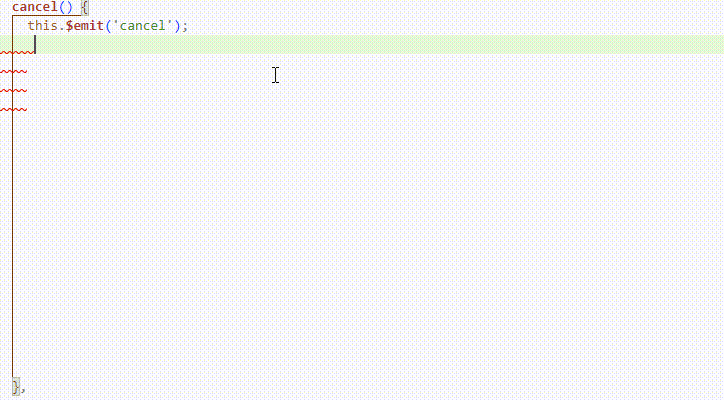

可以把日常常用的一些代码模板配置起来，输入几个前缀就可以自动生成部分代码，比如请求的代码，全局弹窗的代码等等，这样还省得我们自己敲，或者导出去复制粘贴

甚至说，你忘记我这篇主要介绍的是什么了吗？当配合多光标的批量操作时，简直是神兵利器，非常提效

## 实操场景

### 将代码中的中文词条都包裹上 $t 处理

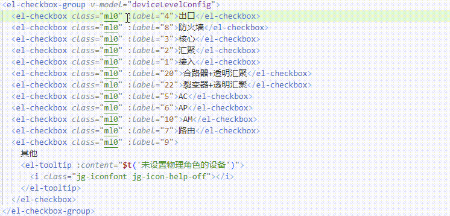

这就是批量操作的提效！

上面动图里，我用上了上面介绍的所有快捷键，全程没有鼠标操作，一气呵成，不知道为什么，这操作下来有种莫名的满足

我先是用 `Shift + 方向键` 选中内容，然后 `Ctrl + D` 来快速往我想要批量操作的内容加上多光标，接着通过 `Ctrl + 方向键` 快速移动光标到中文词条首个字母上，接着 `Shift + End` 选中光标到末尾，接着 `Shift + Ctrl + 方向键` 取消多余的选中内容，让每一行的光标都只选中了中文词条，接着 `Ctrl + X` 剪切，再输入 `t1 + Tab` 触发模板代码生成，最后 `Ctrl + V` 批量粘贴，搞定！

所以，当你熟能生巧之后，相信我，你会爱上批量操作的，不仅提效快捷，还能一定程度上解放鼠标，敲打到一半被迫中断去操作鼠标是很难受的

### 将 el-checkbox 的 label 和 value 关系复制到一个对象里

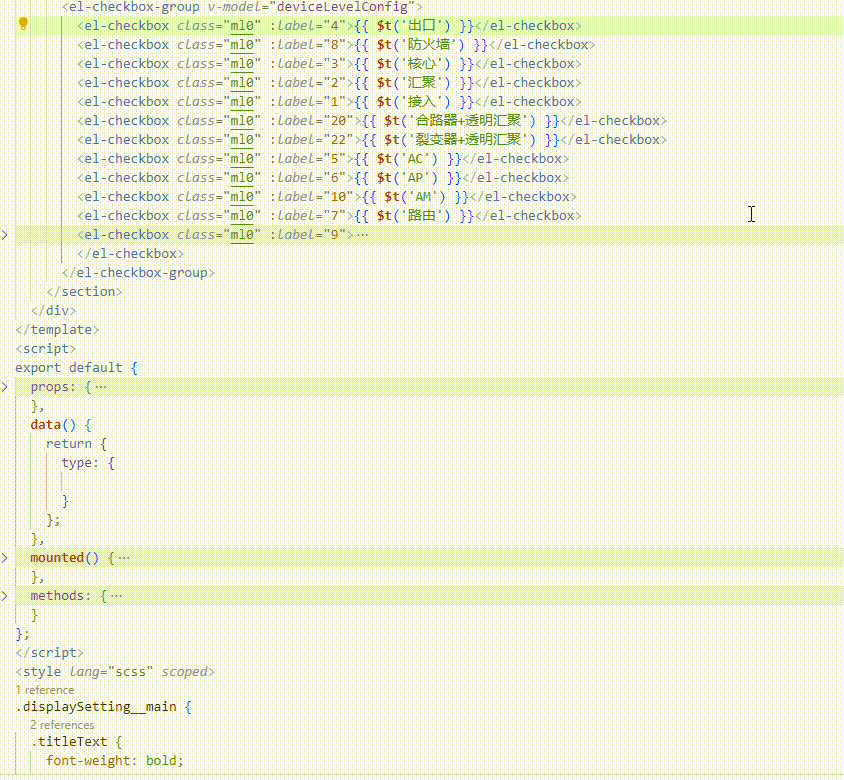

批量复制，粘贴，是不是很提效！
