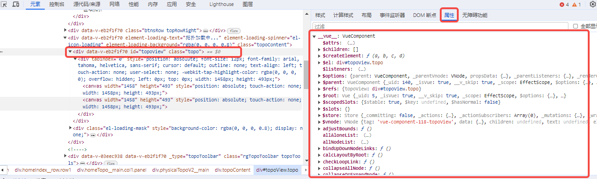
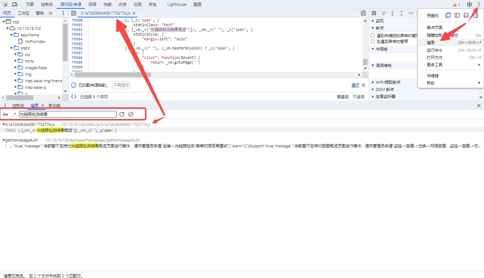
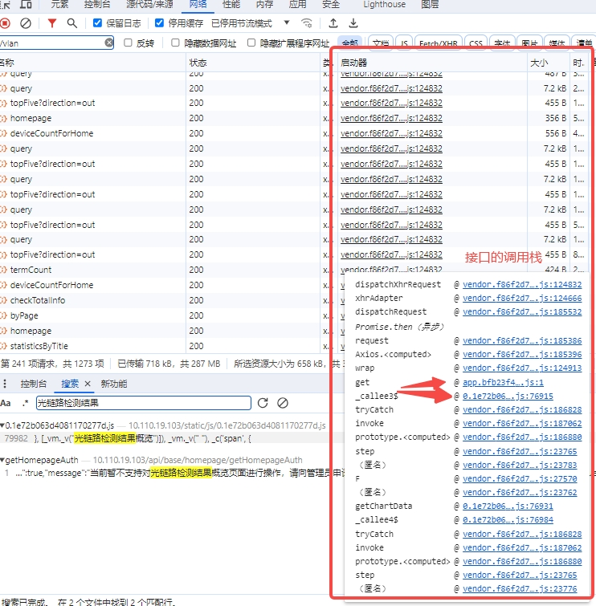
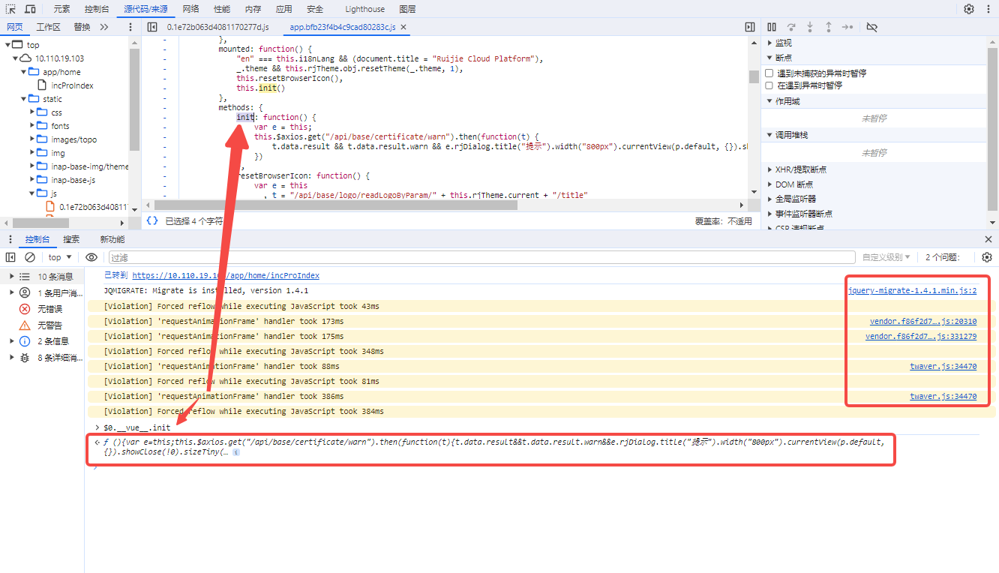
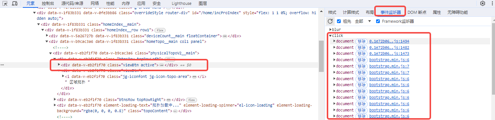
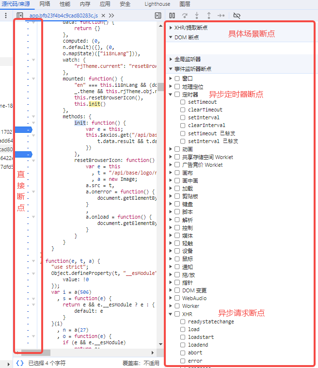
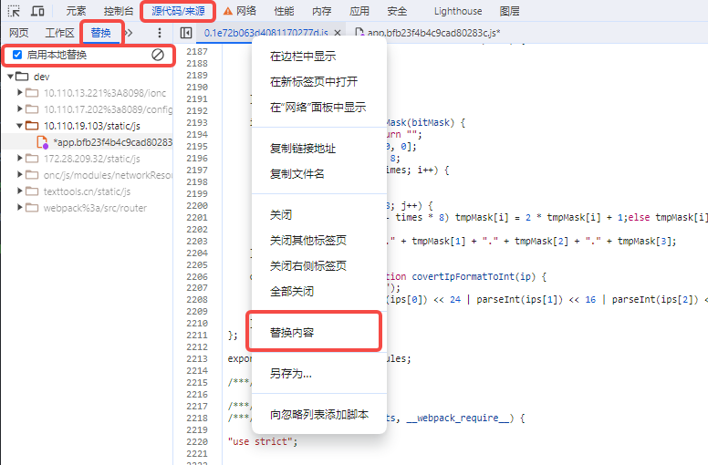

# 善用浏览器的一些调试技巧

## $0 和 \_\_vue\_\_

**$0** 是指当鼠标点击 Element 面板的某个 dom 元素后，console 里 $0 变量会自动指向该 dom 元素对象

**\_\_vue\_\_** 是指 vue 框架会往 vue 组件 $mount 挂载的 dom 元素对象上添加一个 `__vue__` 变量来指向当前 vue 组件

这意味我们可以直接在 console 面板里拿到任意 vue 组件实例对象：

- 可以查看对象内部任意属性
- 也可以直接操作对象内部的属性来达到预期的调试效果
- 甚至可以用来查看三方库的 api，比如 element-ui 的某个组件内部的 api

或许你会疑问，这不是安装 chrome 插件（vue devtools）就可以搞定的事吗，插件还是个可视化界面操作，更直观便捷

没错！插件当然更方便，但没准插件内部实现原理就是这样的呢，掌握这个技巧，也可以在一些插件无法覆盖的场景下来调试页面，比如：

- 生产环境的页面
- 内网部署且无法代理到本地的页面
- 非 chrome 浏览器
- 等等

**举一反三：**

- 很多开源库框架其实都会往绑定的 dom 或者 window 上挂载一些变量上去，善于在 console 利用这些变量，可以方便我们进行很多非本地开发场景下的调试
- 我们日常封装一些复杂业务、复杂组件时，也可以参考这种思路，给自己开一个非本地开发场景下的调试入口，但注意别内存泄漏了
- window 上挂实例对象变量容易导致内存泄漏，所以建议挂一些全局作用域的对象；实例对象尽量挂与他生命周期绑定的 dom 对象

## 接口数据搜索定位

网络面板支持多个维度的搜索功能：

- 根据内容关键词定位接口
  - 常用于看见界面某个文案或者只知道某个关键词，但想定位它是哪个接口返回时的场景
- 在接口返回的内容里定位关键词
- 根据 url 过滤接口

## 源码定位

jquery 时代的网页源码直接原原本本在浏览器上，调试和阅读都非常方便；

前端工程化后，混淆和压缩已经是标配，当出现生产故障时，首先考虑的应该是本地复现或者是将生成环境页面代理至本地的思路来解决；
但总会有某些场景，由于各种受限，只剩下浏览器直接操作的手段，因此，掌握一些源码定位和调试的方式技巧还是有必要的

### 全局搜索

字符串、对象属性字段名这些不会被混淆，可以借助这类场景的关键词来搜索定位源码位置
通常界面也是第一看到的东西，尽量找个界面上看着不像通用类的文案全局搜索下，基本都能定位到对应组件源码

也可以审查元素，在 Element 面板里找到对应 dom 上比较唯一的 class 或 id 等来全局搜索

### 接口调用栈

接口也是逻辑分析的入口点之一，比如找到某个页面呈现数据的请求接口，跟着调用栈走下去基本能梳理界面从拿到数据到呈现做了什么事
但要注意过滤掉三方库（如 axios, vue 等）对接口的封装，找到真实属于逻辑源码的调用栈

### console 面板的函数源码跳转

console 面板上的 log 日志，或者通过 log 输出一个函数，都支持点击跳转到对应源码位置
借助 `$0 和 __vue__` 变量，找到对应组件的某个方法入口，通过 log 输出方法再跳转至源码位置，就能针对性的梳理某个逻辑源码

### 事件监听事件跳转

对于某些按钮等组件的点击之类的事件，可以直接通过审查元素的 Element 面板的 EventListeners（事件监听器）这边查看到该按钮各类事件的监听器
过滤掉三方库的统一事件监听器，找到自己逻辑源码的事件监听器入口，也能针对性梳理该事件处理逻辑源码

## 源码调试

### 断点

代码里加入 debugger 可以触发断点，但前提是本地开发调试模式
也可以直接浏览器上操作断点，除了常规的直接点击源码断点之外，也可以使用一些具体场景的断点，比如定时器触发时进入断点、异步请求响应时断点，DOM 变更时断点等等

### overrides(覆盖)

如果想在浏览器上修改源码并生效的话，需要使用到 overrides（覆盖|替换）功能，如上图
先在 Source(源代码/来源) 面板启用 overrides(替换) 功能，然后找到要编辑的源码文件，右键，点击替换内容（Save for override）
接下去就可以直接浏览器上修改源码，刷新后会加载这份修改后的代码文件

当你发现网络面板有个感汗号警告时，就意味着你启用了本地替换的功能，指定的源码文件不会从网络上加载，而是加载本地临时替换修改过的文件
这样就可以达到直接在源码调试的效果

## 实操场景说明

以上是个人日常比较常用的一些操作，每个技巧都不是割裂开的，经常是组合交叉使用

比如某生产环境来了个故障，本地无法复现，无法代理，还是个内网，只能远程客户设备直接在浏览器界面上调试定位

首先，我们要定位到大概源码，然后分析、断点、调试

怎么定位源码呢：

- 字符串是不会被混淆的，所以可以全局搜索方式来尝试
- 如果匹配点太多，那也可以先定位到某个关键接口，然后根据接口定位到源码
- 如果还是没有定位到，对象的属性是不会被混淆的，所以也可以通过 `$0 和 __vue__` 来根据某个 vue 组件的方法来定位源码

定位到源码后，断点还分析不出问题时，就可以继续利用 `overrides` 覆盖功能来直接修改浏览器源码进行调试
