# 如何使用 whistle 代理神器

【whistle 官网】http://wproxy.org/whistle/install.html

【用途】

- 抓包、mock、修改返回数据、修改响应头字段、延迟模拟弱网等
- 代理转发 - 需要配置代理转发规则
  - 把某环境仅前端资源的请求代理转发到本地
  - 把某个接口地址的请求代理转发到指定的后端环境地址
- 脚本注入
  - 可通过拦截某页面请求，注入写好的脚本工具代码，来完成一些提效的自动化工作

## 安装

### 安装 node 环境

本地如果有 node 环境可跳过

Windows 或 Mac 系统，访问 [https://nodejs.org/](https://nodejs.org/)，安装 LTS 版本的 Node，默认安装即可。

安装完成后，可通过执行 `node -v` 来查看是否安装成功：

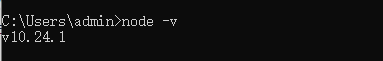

### 安装 whistle

node 安装成功后，执行如下 npm 命令安装 whistle （Mac 或 Linux 的非 root 用户需要在命令行前面加 sudo，如：`sudo npm install -g whistle`）

`npm install -g whistle`

npm 默认镜像是在国外，有时候安装速度很慢或者出现安装不了的情况，如果无法安装或者安装很慢，可以使用 taobao 的镜像安装：

`npm install whistle -g --registry=https://registry.npmmirror.com`

安装完成后，可通过执行 w2 -h 来验证是否安装成功

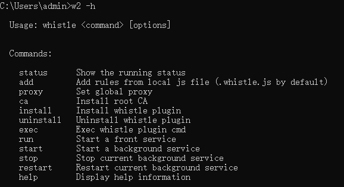

## 启用 whistle 服务

### 启用 whislte 服务

`w2 start`

whistle 服务默认运行在 8899 端口，命令执行成功：

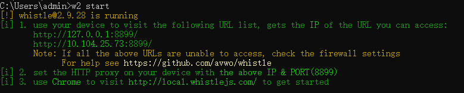

此时可浏览器打开 127.0.0.1:8899

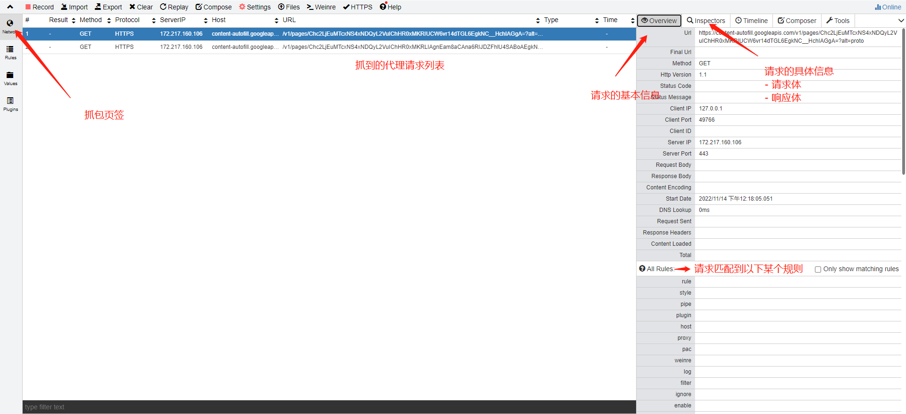

### 启用 https 请求的代理

由于默认是不对 https 请求进行处理，所以需要手动启用下 https 请求的抓包代理开关

启用完毕后，需要再重新启动下 whistle 服务才能生效： `w2 restart` （或者：`w2 stop` 之后再 `w2 start`）

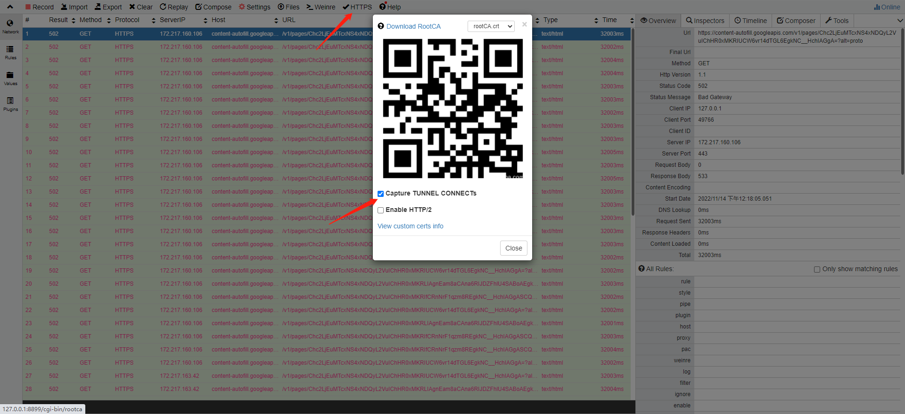

### 安装 https 根证书（可选）

如果你想要使用抓包功能，即查看请求体和响应体内容，那么需要本地电脑安装 whistle 的证书

[http://wproxy.org/whistle/webui/https.html](http://wproxy.org/whistle/webui/https.html)

注意是需要安装到电脑的：受信任的根证书级别才能生效

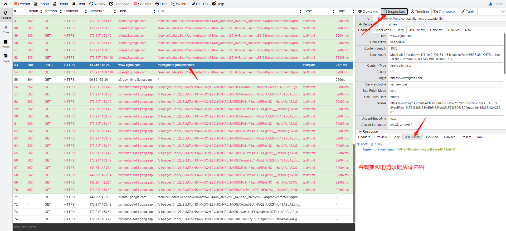

如果你不想用抓包功能，只是想使用代理转发功能，那可以不安装根证书

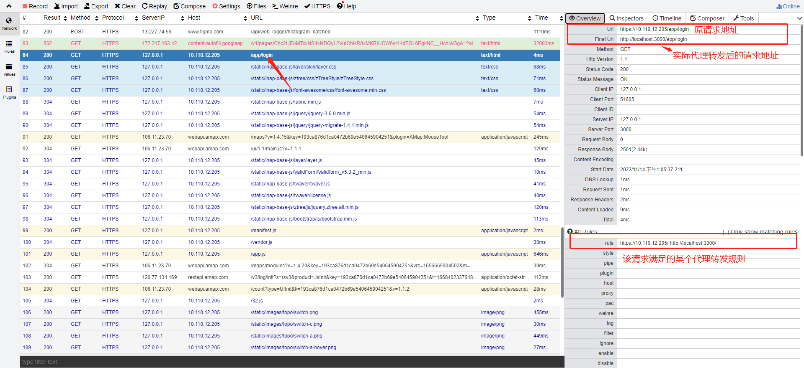

### 常用的 w2 命令

| - 命令-       | -说明-     |
| ------------- | ---------- |
| - w2 start-   | -启用服务- |
| - w2 stop-    | -停止服务- |
| - w2 restart- | -重启服务- |

## 配置代理规则

要使用代理转发功能，你需要告知 whistle，哪些请求在满足什么条件后，代理转发到哪个地址去

所以需要配置代理转发规则，举个实例

### 把访问 10.110.12.205 环境时，所有的前端资源文件都代理转发到本地 localhost:3000 端口

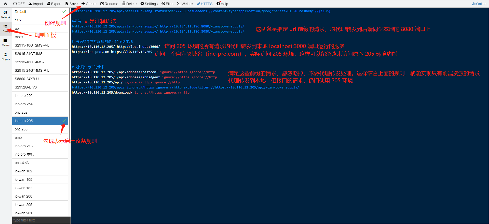

## 配置系统(浏览器)代理走 whistle 的 8899 端口

由于 whistle 服务是运行在 8899 端口上

因此需要让你的浏览器访问的页面请求都经过 8899 端口，这样这些请求才会被 whistle 接管处理

两种方式：直接配置系统代理、只配置浏览器的代理

### 系统代理

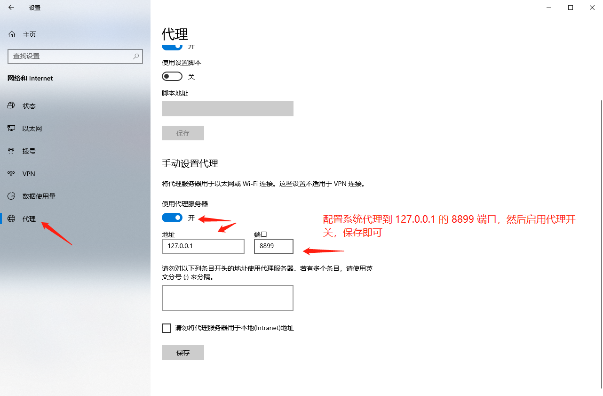

不过系统代理会影响到全局，可能某些应用禁止代理，那功能就会受到影响（比如访问外网使用的云办公应用）

### 浏览器代理

chrome 浏览器支持安装代理插件：SwitchyOmega

F12 - 更多工具 - 扩展程序，然后左键点击安装包拖拽到页面上来安装离线插件

插件不能安装的话，就自行去官网下载安装包

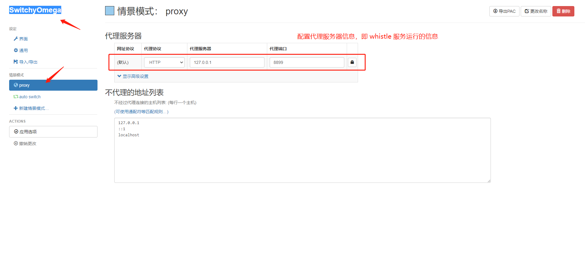

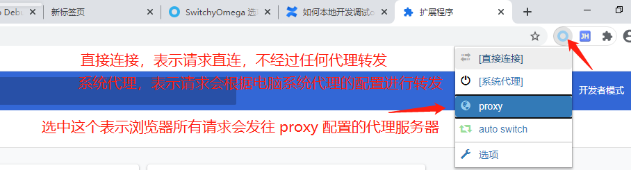
