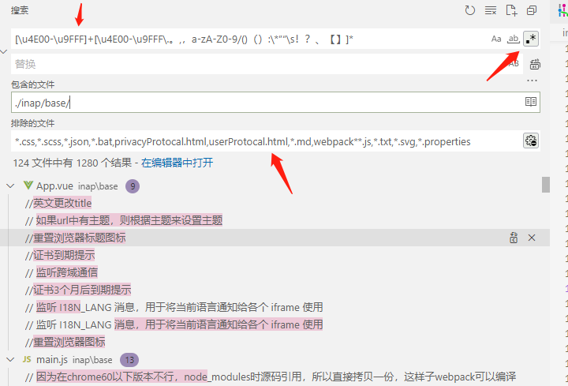

# 如何用 vscode 捞出还未国际化的中文词条

做国际化一个很头疼的坑就是，你不知道项目里到底还有哪些中文词条没有国际化处理

纯靠人工去检查不现实，也不靠谱，而且浪费资源

所以还是得通过脚本工具来检查，思路是：

1. 先保存好本地代码变更，准备好一个无文件变更的本地环境
2. 再通过脚本把代码里的非展示性中文移除掉
   - 注释里的中文、console 里的中文，已经国际化处理过的中文
3. 再用中文正则在 vscode 的全局搜索里匹配，捞出来的就是未国际化处理的中文词条
4. 最后需要回退本地的更改，毕竟脚本是直接改动本地文件

脚本仅仅是检查用，用完记得回退代码

## 匹配中文词条的正则

- 单个中文：
  - `[\u4E00-\u9FFF]`
- 连续中文：
  - `[\u4E00-\u9FFF]+`
- 掺杂了各种符号、字母的中文句子：
  - `[a-zA-Z0-9、：]*[\u4E00-\u9FFF]+[\u4E00-\u9FFF\.\-\*。,，a-zA-Z0-9/()（）:：”“！？、%_【】《》＞~～ ]*`
  - （这里不建议把 : ： - ' " 这几个特殊符号也列到正则里，因为这些符号比较特殊，有的语法层面也支持，列进来反而会引出新问题，所以宁愿这种场景的句子被截成多断）
- 最好再加上文件的排除：
  - `*.css,*.scss,*.less,*.json,*.bat,privacyProtocal.html,userProtocal.html,*.md,webpack**.js,*.txt,*.svg,*.properties,*.npmrc,vve-i18n-cli.config.js,baas,config,*.art,demo_index.html,*.sh,*.xml,*.java`



## 脚本

### 移除非展示性中文的脚本

```javascript
// index.js

#!/usr/bin/env node

/**
 * 用来移除掉指定项目里的以下几类场景的中文：
 * - 注释里的中文
 * - 被国际化全局函数包裹的中文 $t
 *
 * 这样子方便借助 vs code 的全局正则搜索中文功能，来快速 review 未国际化的中文
 * 正则： [\u4E00-\u9FA5]+
 */

"use strict";
const program = require("commander");
const { loadConfig } = require("../configuration");
const core = require("./core");
const vfs = require("vinyl-fs");
const map = require("map-stream");
const path = require("path");
const fs = require("fs");

function commaSeparatedList(value, split = ",") {
  return value.split(split).filter((item) => item);
}

program
  .version(require("../../package.json").version)
  .option("--cwd <path>", "工作目录")
  .option("--root-dir <path>", "国际文本所在的根目录")
  .option(
    "--config <path>",
    "配置文件的路径，没有配置，默认路径是在${cwd}/vve-i18n-cli.config.js"
  )
  .option("--no-config", "是否取配置文件")
  .option(
    "--i18n-file-rules <items>",
    "匹配含有国际化文本的文件规则",
    commaSeparatedList
  )
  .option(
    "--ignore-i18n-file-rules <items>",
    "不匹配含有国际化文本的文件规则",
    commaSeparatedList
  )
  .parse(process.argv);

const config = {
  // 工作目录
  cwd: ".",
  // 根目录，国际文本所在的根目录
  rootDir: "src",
  // 配置文件的路径，没有配置，默认路径是在${cwd}/vve-i18n-cli.config.js
  config: undefined,
  // 是否取配置文件
  noConfig: false,
  // 匹配含有国际化文本的文件规则
  i18nFileRules: ["**/*.+(vue|js|html|htm)"],
  // 不匹配含有国际化文本的文件规则
  ignoreI18nFileRules: ["**/node_modules/**"],
};

Object.assign(config, program);

const CONFIG_JS_FILENAME = "vve-i18n-cli.config.js";

let absoluteCwd = path.resolve(config.cwd);

// 优先判断是否需要读取文件
if (!config.noConfig) {
  let configFilePath = path.join(absoluteCwd, CONFIG_JS_FILENAME);
  if (config.config) {
    configFilePath = path.resolve(config.config);
  }
  if (fs.existsSync(configFilePath)) {
    const conf = loadConfig(configFilePath);
    if (conf && conf.options && conf.options.zhCheck) {
      Object.assign(config, conf.options.zhCheck, program);
    }
  }
}

// 制定配置文件后，cwd在配置文件中定义，则cwd就需要重新获取
if (!program.cwd) {
  absoluteCwd = path.resolve(config.cwd);
}

const absoluteRootDir = path.resolve(absoluteCwd, config.rootDir);

function run() {
  console.log("================================>start");
  vfs
    .src(
      config.i18nFileRules.map((item) => path.resolve(absoluteRootDir, item)),
      {
        ignore: config.ignoreI18nFileRules.map((item) =>
          path.resolve(absoluteRootDir, item)
        ),
        dot: false,
      }
    )
    .pipe(
      map((file, cb) => {
        console.log("开始解析 =========================>", file.path);
        const extname = path.extname(file.path);
        let fileContent = file.contents.toString();
        let newFileContent = fileContent;
        if (extname.toLowerCase() === ".vue") {
          newFileContent = core.removeUnusedZhInVue(fileContent);
        } else if (extname.toLowerCase() === ".js") {
          newFileContent = core.removeUnusedZhInJs(fileContent);
        } else if ([".html", ".htm"].includes(extname.toLowerCase())) {
          newFileContent = core.removeUnusedZhInHtml(fileContent);
        }
        if (newFileContent !== fileContent) {
          console.log("发现无用的中文，正在移除中...");
          fs.writeFileSync(file.path, newFileContent);
        }
        console.log("解析结束 =========================>", file.path);
        cb();
      })
    )
    .on("end", () => {
      console.log("================================>end");
    });
}

run();

```

```javascript
// core.js

// 包含中文
const zhReg = new RegExp("[\\u4E00-\\u9FFF]+", "");

// 处理 vue 文件
function removeUnusedZhInVue(fileContent) {
  return removeUnusedZh(fileContent);
}
exports.removeUnusedZhInVue = removeUnusedZhInVue;

// 处理 js 文件
function removeUnusedZhInJs(fileContent) {
  return removeUnusedZh(fileContent);
}
exports.removeUnusedZhInJs = removeUnusedZhInJs;

// 处理 html 文件
// 处理 js 文件
function removeUnusedZhInHtml(fileContent) {
  return removeUnusedZh(fileContent);
}
exports.removeUnusedZhInHtml = removeUnusedZhInHtml;

function removeUnusedZh(fileContent) {
  const hasAnnotation = {
    "/*": false,
    "<!--": false,
  };

  // 逐行处理
  fileContent = fileContent
    .split("\n")
    .map((line) => {
      // 移除无用中文
      if (line.match(zhReg)) {
        const regs = [
          new RegExp("//(.*[\\u4E00-\\u9FFF]+)", ""), // 移除 // xx
          new RegExp("console.log\\(['\"](.*[\\u4E00-\\u9FFF]+)", ""), // 移除 console.log(xxx)
          new RegExp("console.info\\(['\"](.*[\\u4E00-\\u9FFF]+)", ""), // 移除 console.info(xxx)
          new RegExp(
            "\\$t\\([ ]*['\"`](.*?[\\u4E00-\\u9FFF]+.*?)['\"`]\\)",
            ""
          ), // 移除 $t("xxx")
        ];
        regs.forEach((reg) => {
          let match = line.match(reg);
          while (match && match[1]) {
            line = line.replace(match[1], "");
            match = line.match(reg);
          }
        });
      }
      if (!hasAnnotation["/*"] && line.indexOf("/*") > -1) {
        hasAnnotation["/*"] = true;
      }
      if (!hasAnnotation["<!--"] && line.indexOf("<!--") > -1) {
        hasAnnotation["<!--"] = true;
      }
      return line;
    })
    .join("\n");

  if (hasAnnotation["/*"]) {
    // 移除 /* xxx */
    const reg = new RegExp("/\\*([\\s\\S]*?)\\*/", "g");
    fileContent = fileContent.replace(reg, function (match, key, index) {
      // console.log("[/**/] ==1 >", { match, key, index });
      let newKey = key;
      while (newKey.match(zhReg)) {
        newKey = newKey.replace(zhReg, "");
      }
      return match.replace(key, newKey);
    });
  }
  // 移除 <!--  xxx -->
  if (hasAnnotation["<!--"]) {
    const reg = new RegExp("<!--([\\s\\S]*?)-->", "g");
    fileContent = fileContent.replace(reg, function (match, key, index) {
      let newKey = key;
      while (newKey.match(zhReg)) {
        newKey = newKey.replace(zhReg, "");
      }
      return match.replace(key, newKey);
    });
  }
  return fileContent;
}
```

```javascript
// configuration.js
const buildDebug = require("debug");
const path = require("path");

const debug = buildDebug("files:configuration");

function loadConfig(filepath) {
  try {
    const conf = readConfig(filepath);
    return conf;
  } catch (e) {
    debug("error", e);
    return null;
  }
}

function readConfig(filepath) {
  let options;
  try {
    const configModule = require(filepath);
    options =
      configModule && configModule.__esModule
        ? configModule.default || undefined
        : configModule;
  } catch (err) {
    throw err;
  } finally {
  }
  return {
    filepath,
    dirname: path.dirname(filepath),
    options,
  };
}

module.exports = {
  loadConfig,
  readConfig,
};
```

```json
{
  "dependencies": {
    "commander": "^3.0.2",
    "debug": "^4.1.1",
    "jsonfile": "^5.0.0",
    "lodash.uniq": "^4.5.0",
    "map-stream": "0.0.7",
    "pinyin-pro": "^3.11.0",
    "translation.js": "^0.7.9",
    "vinyl-fs": "^3.0.3",
    "xlsx": "^0.18.5"
  },
  "devDependencies": {
    "chai": "^4.2.0",
    "mocha": "^6.2.1",
    "nyc": "^14.1.1",
    "shelljs": "^0.8.3",
    "standard-version": "^7.0.0"
  },
  "version": "3.2.3"
}
```

```javascript
// vve-i18n-cli.config.js
module.exports = {
  // 工作目录
  cwd: ".",
  // 根目录，国际文本所在的根目录
  rootDir: "demo",
  // 默认所有模块，如果有传module参数，就只处理某个模块
  // '**/module-**/**/index.js'
  moduleIndexRules: ["*/pro.properties"],
  // 匹配含有国际化文本的文件规则
  i18nFileRules: ["**/*.+(vue|js)"],
  // 国际化文本的正则表达式，正则中第一个捕获对象当做国际化文本
  i18nTextRules: [/(?:[\$.])t\(['"](.+?)['"]/g],
  // 模块的国际化的json文件需要被保留下的key，即使这些组件在项目中没有被引用
  // key可以是一个字符串，正则，或者是函数
  keepKeyRules: [
    /^G\/+/, // G/开头的会被保留
  ],
  ignoreKeyRules: [/^el/],
  // 生成的国际化资源包的输出目录
  outDir: "i18n",
  // 生成的国际化的语言
  i18nLanguages: [
    "zh", // 中文
    "en", // 英文
  ],
  // 是否翻译
  translate: false,
  // 翻译的基础语言，默认是用中文翻译
  translateFromLang: "zh",
  // 是否强制翻译，即已翻译修改的内容，也重新用翻译生成
  forceTranslate: false,
  // 翻译的语言
  translateLanguage: ["zh", "en"],
  // 模块下${outDir}/index.js文件不存在才拷贝index.js
  copyIndex: true,
  // 是否强制拷贝最新index.js
  forceCopyIndex: false,
  // 国际化文本包裹相关
  zhWrap: {
    cwd: ".",
    // 根目录，国际文本所在的根目录
    rootDir: ".",
    i18nFileRules: [
      "!(node_modules|config)/**/*.+(vue)",
      // "base/components/login.vue",
      "base/common/js/httpHandle.js",
    ],
    ignorePreReg: [
      /t\s*\(\s*$/,
      /tl\s*\(\s*$/,
      /console\.(?:log|error|warn|info|debug)\s*\(\s*$/,
      new RegExp("//.+"),
    ],
    // js相关文件需要引入的国际化文件
    i18nImportForJs: "import i18n from '@inap_base/i18n/core'",
    // js相关文件需要使用国际化方法
    jsI18nFuncName: "i18n.t",
    // vue相关文件需要使用的国际化方法
    vueI18nFuncName: "$t",
  },
};
```

### 硬替换脚本

具体查看 zh-i18n.zip
