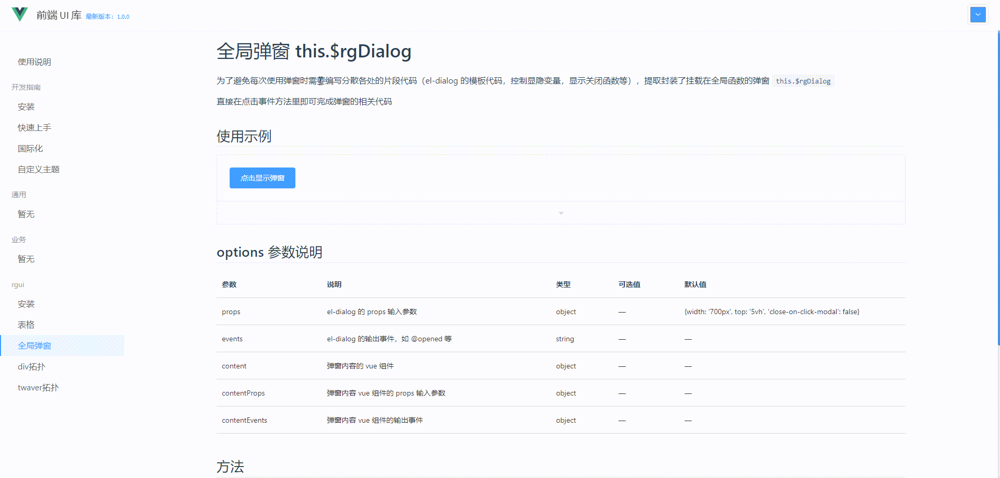

# 自定义 md-loader 来简单高效的维护组件文档

个人觉得，组件库最难的不是开发，而是使用，怎么才能让组内同事都用起来，这才是关键

## 背景

虽然现在开源的组件库很多，但每个项目里还是或多或少都会有人封装出一些项目内通用的基础组件、业务组件

我参与过多个项目，几乎每个项目都会存在这么一种现象：**重复造轮子**

同一个用途的组件被不同人多次实现，导致后续维护的人可能都不知道该用哪个好，或者干脆又自己撸了一个，就又恶性循环了

至于如何解决，遇到的基本就是强制定规范，但这种靠人为主观意识的约定，很容易松动，不长久

## 痛点

其实可以来分析下看看，为什么就会用不起来呢？

为什么大家乐意去用一些开源组件库，就是不想用项目里别人封装的呢？

就我个人而言，可能有这么几个原因：

- 我不知道原来项目里已经有这么个通用组件了
- 我找到组件代码，但我不确定这个组件呈现效果是什么，是不是我想要的，对业务不熟，与其慢慢去捞页面找试用，干脆自己再撸一个
- 我找到组件代码，也找到页面呈现效果，但我不知道该怎么使用，需要花时间去看源码

于是我反思，那我为什么会乐意去用开源组件库，比如 element-ui 组件呢：

- 官网可以直接找到所有组件呈现效果和示例代码
- 官网的配置项说明足够使用组件，而无需去看源码

所以对我来说，根源不是不想用同事封装的组件，而是懒得去看源码，去找示例

我更在意的是**组件呈现效果和示例代码以及参数配置项说明**

- 示例代码和参数配置项说明可以通过编写 md 文档来实现
- 组件呈现效果需要另外开发个 demo 组件来编写示例代码并运行

这意味着，封装一个组件，除了写文档，还需要再开发一个组件使用 demo，成本有些大，维护也麻烦

那么，有没有什么办法可以简化呢？

## 解决方案：自定义 md-loader

md-loader 是一个自定义的 webpack loader，用来解析 md 文件的，简单来说，它做了两件事：

- 将 md 解析成 vue 组件，以便 vue 项目里可以直接将 md 当作 vue 组件使用
- 自定义 md 语法 `::: demo`，以便达到只需在 md 中编写组件示例代码，解析后的 vue 代码会自动将组件示例代码运行起来，呈现真实效果

有了 md-loader 的这两个能力，我们可以再基于 require.context 搞个自动挂载组件路由

这样一来，我们只要在每个组件目录下搞个 README.md 文档，里面贴上组件示例代码，然后运行项目，打开组件路由就可以像使用 element-ui 组件官网一样来翻看我们的组件文档了

我们还可以再集成 monaco-editor 就可以实现一个简易的在线编辑调试代码的功能

如：[在线体验下](http://59.110.12.45:9002/#/rgui/%E5%85%A8%E5%B1%80%E5%BC%B9%E7%AA%97)



上面示例中的组件使用说明文档内容，包括呈现效果和示例代码，全程都只需要在 md 文档里编写即可，而无需额外编写其他 demo 代码，如：

````
# 全局弹窗 this.$rgDialog

为了避免每次使用弹窗时需要编写分散各处的片段代码（el-dialog 的模板代码，控制显隐变量，显示关闭函数等），提取封装了挂载在全局函数的弹窗 `this.$rgDialog`

直接在点击事件方法里即可完成弹窗的相关代码

## 使用示例

::: demo

```vue
<template>
  <div>
    <el-button type="primary" @click="showDialog">点击显示弹窗</el-button>
  </div>
</template>

<script>
import dialogContent from "@docs/使用说明.md";
export default {
  data() {
    return {};
  },
  mounted() {},
  methods: {
    showDialog() {
      const rgDialog = this.$rgDialog({
        props: {
          title: "弹窗标题",
          width: "80vw",
          "close-on-click-modal": true
        },
        events: {},
        content: dialogContent,
        contentProps: {},
        contentEvents: {
          cancel: () => rgDialog.close()
        }
      }).show();
    }
  }
};
</script>

<style lang="scss" scoped></style>
```

:::

## options 参数说明

| 参数          | 说明                                | 类型   | 可选值 | 默认值                                                      |
| ------------- | ----------------------------------- | ------ | ------ | ----------------------------------------------------------- |
| props         | el-dialog 的 props 输入参数         | object | —      | {width: '700px', top: '5vh', 'close-on-click-modal': false} |
| events        | el-dialog 的输出事件，如 @opened 等 | string | —      | —                                                           |
| content       | 弹窗内容的 vue 组件                 | object | —      | —                                                           |
| contentProps  | 弹窗内容 vue 组件的 props 输入参数  | object | —      | —                                                           |
| contentEvents | 弹窗内容 vue 组件的输出事件         | object | —      | —                                                           |

## 方法

`this.$rgDialog()` 返回的弹窗实例对象的方法：

| 方法名 | 说明     | 参数 |
| ------ | -------- | ---- |
| show   | 显示弹窗 | —    |
| close  | 关闭弹窗 | —    |


````

### md-loader 实现原理

这个 loader 是我前司一同事自己开发的，这是他的源码仓库和技术实现细节文档：

- [https://github.com/luchx/md-enhance-vue](https://github.com/luchx/md-enhance-vue)
- [在 Markdown 中 使用 Vue](https://www.yuque.com/luchx/ziwg5m/df00sl)

原理细节和源码可以移步到相关链接查看，这里简单概述下 md-loader 内部原理，一句话解释：

**将 md 转成的 html 包裹到 vue 的 template 标签内，因此 md 可以直接被当作 vue 组件在代码里被引用，同时自定义扩展 md 的 ::: demo 语法，以便支持组件效果和示例代码可以呈现**
loader 工作原理：

1. 基于 markdown-it 系列插件将 md 转成 html
2. 如果 md 里没有 ::: demo 场景，则直接将转成的 html 放到 vue 的 template 块里，交给 vue-loader 解析
3. 如果有 ::: demo 场景，进入自定义解析 ::: demo 流程
   - 将 demo 里的 ```vue 代码块字符串化后放到 `<demo-block>` 标签里的 highlight 插槽上。
     - 字符串化的过程做了系列代码的高亮、行号等显示处理
   - 再把 ```vue 代码块封装到单独的 vue 组件里，组件内部自动命名，然后给挂载到 `<demo-block>` 标签里的 source 插槽上
   - `<demo-block>` 组件就可以用 highlight 插槽来把代码块呈现出来，同时用 source 插槽来引用 loader 生成的子组件，以达到代码块运行的效果

### require.context 自动注册路由

```js
// 递归遍历当前目录下为 .md 结尾的文件
const files = require.context(".", true, /\.md$/);

files.keys().forEach((filePath) => {
  // 省略根据文件路径名生成路由配置信息
  // 生成路由配置相关信息,路由直接以组件目录名
  const routerConfig = {
    title: fileName,
    path: `/${pathParts.join("/")}/${fileName}`,
    component: files(filePath).default,
  };
});
```

这样就不需要每新增一个组件, 都需要手动去注册路由信息了
注: 脚本可以借助 ChartGPT 完成, 描述好诉求就行

### monaco-editor 在线代码编辑器

[Vue 实现在线代码编辑和预览](https://www.yuque.com/luchx/ziwg5m/ryqc71)

## 小结

只需用 md 就能完成组件使用平台的搭建, 而无需再编写额外的 demo 等成本投入, 较低成本换来使用人的直观, 方便, 快捷的使用组件
