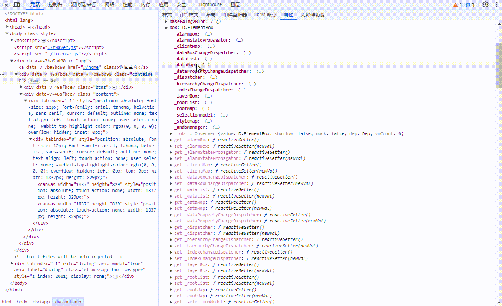
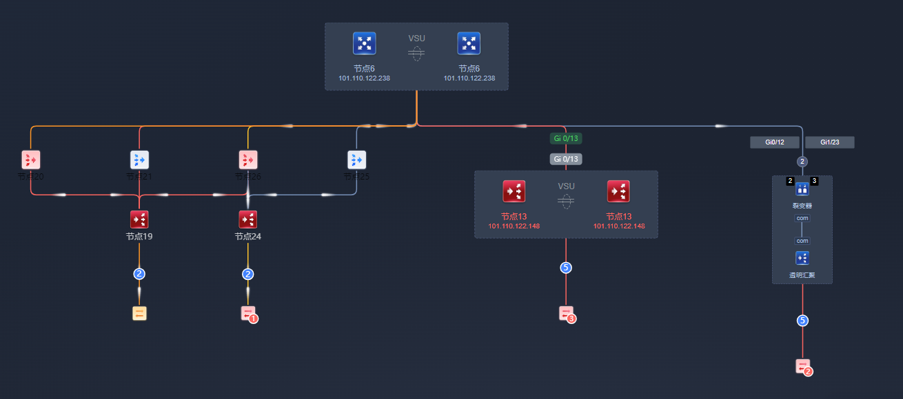

# 记一次卡顿的性能优化经历实操

本篇的性能优化不是八股文类的优化方案，而是针对具体场景，具体分析，从排查卡顿根因到一步步寻找解决方案，甚至是规避等方案来最终解决性能问题的经历实操

所以，解决方案可能不通用，不适用于你的场景，但这个解决过程是如何一步步去处理的，解决思路是怎么样的，应该还是可以提供一些参考、借鉴意义的

当然，也许你还有更好的解决方案，也欢迎评论教一下，万分感谢

## 问题现象

我基于 `twaver.js` 库实现了一个园区内网络设备的拓扑呈现，连线表示设备间的拓扑关系，线路上支持流动动画、告警动画、链路信息等呈现，如：


但当呈现的节点数量超过 1000 后，动画开始有点丢帧，操作有点点滞后感

超过 5000 个节点后，页面就非常的卡顿，难以操作

所以，就开始了性能优化之路

## 猜测&验证

### 猜测 1：Vue 框架的响应式处理导致的性能瓶颈

之所以有这个猜测是因为，我在官方给的 demo 上体验时，上万个节点时都不卡顿，更何况是一千个节点而已

而我的项目跟官方 demo 的差异有两块：

- 我用 vue 框架开发，官方 demo 用的纯 html + js
- 我功能已经开发完，所以实际上还参杂了其他各种实现的代码，官方 demo 很简单的纯节点和链路

为了验证这个猜想，我另外搞了个空项目，纯粹就只是把官方 demo 的代码迁移到 vue 上运行起来而已，如：

**【10000 个节点，20000 条连线，twaver 官方 demo 耗时 250ms，不卡顿】**


**【10000 个节点，20000 条连线，vue 实现的 demo 耗时 11500ms，操作上有 0.5s 的滞后感】**


**同样的代码，同样的数据量，区别仅仅是一个用纯 js 实现，一个用 vue 实现，但两边的耗时差异将近 45 倍**

所以就开始思考了，Vue 框架能影响到性能问题的是什么？

无非不就是响应式处理，内部会自动对复杂对象深度遍历去配置 setter, getter 来拦截对象属性的读写

而 twaver 的对象结构又非常复杂，就导致了一堆无效的响应式处理耗时资源：



看到没有，twaver 的两个变量 box 和 network，内部结构非常复杂，N 多的内嵌对象，全部都被响应式处理，这占用的资源是非常恐怖的

_（注：Vue2.x 版本可以直接在开发者工具面板上查看对象内部是否有 setter 和 getter 就知道这个对象是否有被响应式处理）_

但我们其实又不需要它能够响应式，我们只是想使用 twaver 对象的一些 api 而已

那么该怎么来避免 Vue 对这些数据进行的响应式处理呢？

下一章节里再具体介绍解法，至少到这里已经明确了卡顿的根因之一是 Vue 对 twaver 的数据对象进行了响应式处理而引发的性能瓶颈

### 猜测 2：动画太多导致的性能瓶颈

这个应该是显而易见的根因之一了，每条链路上都会有各种动画，而实现上又是每条链路内部自己维护自己的动画管理器（twaver.Animate）

简单去捞了下 twaver 内部源码实现，动画管理器用了 `requestAnimationFrame` 来实现动画帧，用了 `setTimeout` 来实现动画的延迟执行

那么当节点成千上万时，肯定会卡顿，毕竟这么多异步任务

而之所以会这么实现，原因之一是官方给的链路动画 demo 就是这么做的，当初做的时候直接用 demo 方案来实现了

而 demo 显然只是介绍链路动画怎么实现而已，不会给你考虑到极端场景的性能瓶颈问题

那么怎么解决呢？不难，无非就是抽离复用 + 按需刷新思路而已，具体也是下面讲解

### 猜测 3：一次性呈现的节点链路太多导致的性能瓶颈

这也是显而易见的根因之一，就像长列表问题一样，一次性呈现的节点链路太多了，必然会导致性能瓶颈问题

也不需要去验证了，思考解决方案就行

但这跟长列表实现上有点不太一样，因为 twaver 内部是用 canvas 来绘制节点和链路的，并不是用 dom 绘制，所以虚拟列表那种思路在这里行不通

但本质上的解决都一个样，无非就是一次性没必要呈现这么多节点，因为一屏内又显示不了，没有意义

所以，按照这种思路去寻找解决方案，具体也下面讲讲

### 猜测 4：dom 节点太多导致的性能瓶颈

虽然 twaver 内部是用 canvas 绘制的节点和链路，但当节点毕竟复杂时，比如：



这种时候用 canvas 画不出来，只能用 div 绘制，twaver 也支持 HTMLNode 类型节点，这就意味着也会存在 dom 过多的场景

而 dom 导致的性能问题包括 dom 元素过多，频繁操作 dom

因此解决方案上就是尽量避免创建过多的 dom 元素以及避免频繁操作 dom 即可，具体也下面讲

## 解决方案

### 绕过 Vue 的自动对数据模型进行的响应式处理

Vue2.x 框架内部会自动将声明在 data 里的变量进行响应式处理，第一个想到的是尝试用 Object.freeze 来冻结对象，例如：

`this.box = Object.freeze(new twaver.ElementBox());`

但有两个问题：

- Object.freeze 是浅冻结，不是深度冻结，内嵌的对象好像还是会被响应式处理
- 可能会引发功能异常，因为没法确认三方库内部是否有用到对象的枚举、遍历、扩展等能力

那么还有其他什么方案吗？

如果是 Vue3.x 的话，因为响应式处理是显示调用，就没有这些烦恼了。

至于 Vue2.x，内部自动进行了响应式处理，因此我们需要去源码里看看有没有什么办法可以绕过响应式处理。

_注：下面是 Vue 2.7.16 版本的源码_

源码里给 data 数据进行响应式处理是在 `core/instance/state.ts#initData()`

```typescript
// core/instance/state.ts
function initData(vm: Component) {
  let data: any = vm.$options.data;
  data = vm._data = isFunction(data) ? getData(data, vm) : data || {};
  // 省略判断 data 为对象的代码
  //  ...

  const keys = Object.keys(data);
  const props = vm.$options.props;
  const methods = vm.$options.methods;
  let i = keys.length;
  while (i--) {
    const key = keys[i];
    // 省略判断 data 的字段与 props 或 methods 是否有同名的场景
    // ...

    // 判断变量命名是否是 _ 或 $ 为前缀
    if (!isReserved(key)) {
      proxy(vm, `_data`, key); // 这里是关键之一，把 data 里的对象挂载到外部 vue 组件上
    }
  }
  const ob = observe(data); // 响应式处理 data 数据
  ob && ob.vmCount++;
}
```

上面的源码里我省略了一些无关的代码，然后有两个关键点，一个是通过 `isReserved(key)` 判断变量命名是否是以 `_` 或 `$` 开头的代理处理，另一个是 `observe(data)` 处理响应式的 data 数据

第一点等会再讲，先来看看是怎么对 data 数据进行响应式处理的：

```typescript
// core/observer/index.ts
export function observe(
  value: any,
  shallow?: boolean,
  ssrMockReactivity?: boolean
): Observer | void {
  // 如果该对象已经响应式处理过了，就跳过，没必要再次处理
  if (value && hasOwn(value, "__ob__") && value.__ob__ instanceof Observer) {
    return value.__ob__;
  }
  // 当满足下面条件时，对对象进行响应式处理
  if (
    shouldObserve && // 总开关
    (ssrMockReactivity || !isServerRendering()) && // 非服务端渲染场景
    (isArray(value) || isPlainObject(value)) && // 数组或对象
    Object.isExtensible(value) && // 支持扩展（即动态增删字段）
    !value.__v_skip /* ReactiveFlags.SKIP */ && // 是否跳过响应式处理
    !isRef(value) && // // 是否是响应式对象
    !(value instanceof VNode) // 是否是 VNode 对象
  ) {
    // 内部遍历对象的属性，调用 defineReactive() 来对属性进行 setter, getter 拦截
    // 而 setter 里又重新调用 observe() 处理属性值，从而达到深度递归处理内嵌对象属性的响应式效果
    return new Observer(value, shallow, ssrMockReactivity);
  }
}
```

所以，我们其实是有办法来绕过响应式处理的，比如给对象增加一个要跳过响应式处理的标志 `__v_skip`，如：

```javascript
const box = new twaver.ElementBox();
box.__v_skip = true; // 这个是关键
this.box = box;

const network = new twaver.vector.Network(this.box);
network.__v_skip = true; // 这个是关键
this.network = network;
```

_注意：`__v_skip`是 Vue2.7.x 版本后加入的逻辑，在 Vue2.6 及之前版本里，并没有该逻辑，相反只有一个 `_isVue` 标志位判断_

有人说，不用这么麻烦，把变量命名改成 `_` 为前缀，也能绕过响应式处理，这是真的吗？毕竟源码里好像没有看到相关的代码

别急，还记得我上面介绍 `initData()` 源码里的两个关键点之一的 ``

```typescript
// core/instance/state.ts
function initData(vm: Component) {
  // 省略其他无关代码
  //  ...
  while (i--) {
    // 省略其他无关代码
    //  ...

    // 判断变量命名是否是 _ 或 $ 为前缀
    if (!isReserved(key)) {
      // 把 data 里的对象挂载到外部 vue 组件上
      proxy(vm, `_data`, key);
    }
  }
  // 省略其他无关代码
  //  ...
}
```

这里会遍历 data 里的各个属性字段，然后把里面非 `_` 或 `$` 为前缀的变量都挂到外部 Vue 组件实例上，这样我们代码里才可以直接用 `this.xxx` 来操作这些变量

由于我们命名了 `_box`，`_network` 变量，这些以 `_` 开头的变量就没有被挂到 Vue 组件实例上，而后续我们代码里使用 `this._box = xxx` 这样来赋值变量，其实本质上是动态的往 Vue 组件实例上增加了一个 `_box` 变量，由于 Vue2.x 不支持对动态添加的属性进行响应式处理，因此这才能达到绕过响应式处理的效果

**所以把变量命名改成 `_` 为前缀，其实是误打误撞的刚好绕过了响应式处理**

Vue 官方文档里其实也有解释说了：

> Properties that start with \_ or $ will not be proxied on the Vue instance because they may conflict with Vue’s internal properties and API methods. You will have to access them as vm.$data.\_property

大意就是，Vue 内部变量命名就是以 `_` 和 `$` 为前缀命名，因此不会把 data 里以 `_` 和 `$` 开头的变量挂到外部上来，防止变量命名冲突覆盖掉内部变量而引起异常。因此当 data 里有这些变量时，使用时应该要 `this.$data._xxx` 的方式来操作这些变量

虽然是误打误撞的绕过了响应式处理，但这种方案不会让代码更繁琐，使用上还算方便，就是需要放开 eslint 的 `vue/no-reserved-keys` 校验规则

**【举一反三】**

当用到其他一些三方库，三方库变量又不是全局而是当前组件内的局部变量 data 内部时，都会存在被 Vue 响应式处理的问题。

如果你也有遇到这种场景，不防往这方面去考虑看看如果绕过响应式处理

### 共同复用全局的动画管理器 + 按需刷新

**【原实现方案】**

每条链路的动画由各自内部实现：

```javascript
export default function FlowLink() {
  FlowLink.superClass.constructor.apply(this, arguments);
  this._animate = this.getAnimate();
}

twaver.Util.ext(FlowLink, twaver.Link, {
  play: function (options) {
    this._animate.play();
    return this._animate;
  },
  getAnimate: function (options) {
    // 内部自己的动画管理器
    this._animate = new twaver.Animate(
      Object.assign(
        {
          from: 0,
          to: 1,
          repeat: Number.POSITIVE_INFINITY,
          reverse: false,
          delay: 200, // 动画延迟
          dur: 5000, // 动画时才
          easing: "linear", // 线性动画
          onUpdate: (value) => {
            // 更新动画进度
            this.setClient("anim.percent", value);
          },
        },
        options
      )
    );
    return this._animate;
  },
});
```

而每条链路都是独立的 FlowLink 实例对象，当达到成千上万条链路时，资源就被撑爆了，很卡

**【复用全局动画管理器思想】**

其实，每条链路内部的动画管理器是一模一样的，那我们其实可以实现一个全局的统一动画管理器，这样不管链路有多少条，我们的动画管理器都只有 1 个

但动画管理器就要有种途径来找到各个链路，这样才能触发链路的刷新，以便它们内部根据最新动画进度来进行渲染

**【按需刷新思想】**

既然动画管理器内部需要捞取到链路来刷新，那干脆，只捞取屏幕可视范围内的链路进行刷新，屏幕外部的链路就不通知刷新

这样不就更节省性能损耗了

```javascript
export default function FlowLink() {
  FlowLink.superClass.constructor.apply(this, arguments);
}

twaver.Util.ext(FlowLink, twaver.Link, {
  play: function () {
    // 链路内部不维护动画管理器了，只需要加个动画开关即可
    this.setClient("anim.enable", true);
  },
});
```

```javascript
export default class GLobalAnimation {
  constructor(network) {
    this._network = network; // 与动画关联的拓扑画布
    this._linkAnimation = null; // 链路动画实例
    this._linkAnimPercent = 0; // 链路动画进度
  }

  playLinkAnimation() {
    if (!this._linkAnimation) {
      this._linkAnimation = this._initLinkAnimation();
      this._linkAnimation.play();
    }
  }

  _initLinkAnimation() {
    return new twaver.Animate({
      from: 0,
      to: 1,
      repeat: Number.POSITIVE_INFINITY,
      reverse: false,
      delay: 200, // 动画延迟
      dur: 5000, // 动画时才
      easing: "linear", // 线性动画
      onUpdate: (value) => {
        // 只重绘可视范围内的链路
        try {
          const state = this._network.state || {};
          // 滑动、缩放、布局过程中，都没必要更新UI
          const isReady = !state.zooming && !state.panning && !state.layouting;
          if (isReady) {
            // 获取经过缩放后的可视范围
            const viewRect = this._getZoomRect(this._network.getViewRect());
            // 根据可视范围，获取范围内的链路对象
            const nodes = this._network.getElementsAtRect(viewRect, true);
            nodes.forEach((node) => {
              // 刷新指定链路节点
              this._network.invalidateElementUI(node, false);
            });
          }
        } catch (error) {
          console.error("[GlobalAnimation]", error);
        }
      },
    });
  }

  _getZoomRect(rect) {
    const zoom = this._network.getZoom() || 1;
    const offset = 200;
    return {
      x: (rect.x - offset) / zoom,
      y: (rect.y - offset) / zoom,
      width: (rect.width + offset * 2) / zoom,
      height: (rect.height + offset * 2) / zoom,
    };
  }
}
```

这种思路有点像一开始只站在局部角度来思考代码实现，优化后则是站在全局角度上来进行的思考

**而解决思路则是万能的复用，万能的懒加载，按需使用思想**

### 交互上进行规避，如增加默认折叠、展开处理

由于节点是直接借助 twaver 内部的 canvas 实现，因此节点数量太多导致的性能瓶颈问题是 twaver 库本身就存在的问题，虽然 twaver 已经做到 1W 级别的节点的丝滑呈现，但当数量继续加上去，达到 5W，10W 级别时，也会开始出现操作滞后感，卡顿等性能瓶颈

也许你会说，简单，跟上个问题一样，按需加载不就行了，只绘制屏幕可视范围内的节点，其余节点不绘制

理论上可行，但实现上难度很大

因为上一个问题是节点链路已经绘制完毕的基础上，来进行刷新范围的过滤，所以只需要根据坐标点信息的计算就能达到诉求

但现在场景是还没绘制，你没法获知任何信息

你不知道经过缩放、拖拽后的当前视图里，到底应该呈现哪些节点

而且，twaver 是付费框架，源码是混淆的，你不知道内部它是怎么实现的，无法参与节点的排版过程，也导致你很难下手去实现所谓的按需绘制问题

再者，我们还有搜索定位的交互需求，就算你上面问题都解决了，那当搜索的节点是没绘制的节点，你如何去定位到该节点真实的位置

基于以上种种原因，考虑到投入成本的性价比，我们最终决定采用从非技术角度去优化：**从交互上进行规避**

- 增加节点的默认折叠处理方案，当超过一定数量时，默认把子孙节点折叠起来，这样能够避免一次性渲染太多节点
- 同时增加展开/折叠全部节点的快捷操作
- 由于孤点没有树形结构，因此当超过一定数量孤点时，需要另外处理折叠逻辑
- 搜索节点时，发现节点处于折叠状态的话，要自动进行展开处理

简单来说就是会设定一个阈值，当节点超过这个数量时，都折叠起来，等用户手动去展开再呈现，相当于**分页呈现的思想**

### dom 节点的懒创建 + 缓存和复用

有些复杂节点的场景无法用 twaver 的默认节点样式呈现，也就用不了 canvas 实现，只能自己用 html 方式来实现

但也不可能用纯 html + js 实现，还是依赖于 vue 框架，这就涉及到 vue 组件的手动创建、挂载、销毁

这种复杂节点过多时，就会涉及到 dom 元素的反复创建、销毁以及渲染过多的性能瓶颈问题

那么解决方案上，一样也是懒加载，但为了组件可以复用，增加了缓存和复用处理，避免相同组件要重复创建

具体做法则是：

- 重写了 twaver 绘制 dom 元素的方法逻辑，改造成懒加载方式
  - 即当节点不在页面可视范围内的话，不挂载 dom 到界面上，避免一次性渲染太多 dom
- 收集缓存所有的 dom 组件
  - 当反复使用时，直接复用缓存
  - 当销毁时，手动触发 vue 的 destroy，及时销毁资源

## 小结

其实，大多数的性能问题本质上都是大同小异的原因：

- **无意义的内存占用过高**，如 Vue 对 twaver 数据对象的响应式处理
- **一次性处理的东西过多**，如渲染上万个节点
- **短时间内频繁执行某些其实没意义的操作**，如实时刷新即使在屏幕外的动画
- **反复创建、销毁行为**，如 dom 节点的反复创建

所以性能优化的难点之一在于排查根因，找到问题所在后，才能去着手思考对应的解决方案

而解决思路无外乎也是大同小异：

- **按需使用、懒加载、分页**
- **缓存和复用**
- **规避方法**
