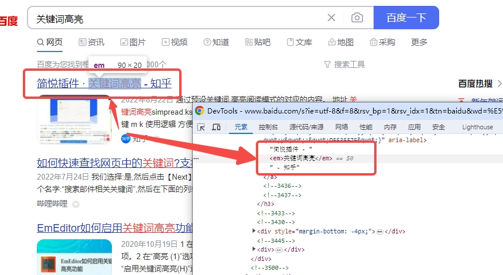

# 项目国际化的难点痛点是什么

如果有做过项目国际化的应该了解, 国际化的工作项大概包括以下几项：

**【词条相关工作】**

- 文本包裹翻译函数，如 $t
- 提取翻译词条到 json 文件里
- 翻译并更新 json 文件

**【三方库相关工作】**

- 组件库的国际化配置，如 element-ui 组件库
- 其他有词条场景的三方库的国际化配置

**【图片、文件相关工作】**

- 图片里出现中文时，需要准备国际化的图片资源
- 文件里出现中文时，需要准备国际化的文件资源
  - 通常是表格导入导出的 excel 文件、用户声明和软件协议等 pdf 文档或静态 html 文件

**【样式相关工作】**

- 国际化后的文本可能会出现显示溢出、截断、乱换行、排版错乱、未对齐等场景，
  - 需要针对不同语言处理不同样式，互不影响

如果没有相关经验的，经常会以为国际化只有词条相关工作项，这就是第一个坑点：工作量的评估过于乐观，遗漏其他工作项

但当你真正去开发一个国际化项目后，你会发现，国际化的难点、痛点、坑点远不止表面看到的这些，尤其是后期维护，痛点更大

相反，词条工作可能都是最轻松的工作了，因为圈子里有各种各样的自动化脚本工具来辅助你完成

下面我们就来聊一聊国际化里的各种痛点

**如果你经历过，欢迎一起来吐槽补充**

**如果你没经历过，希望这些痛点可以帮助你在将来如果遇到国际化工作时，可以更有准备的做好评估工作**

## 词条相关工作的痛点

### 痛点：词条出现在各种各样的地方

这里以 vue2.x 项目为例，词条有可能存在于 vue 文件的 template 里，script 里，甚至 style 里；也可能存在于 js 文件里，html 文件里。出现在不同地方，需要使用的翻译函数可能都不一样，如：

```vue
<template>
  <div>
    <div>{{ $t("这里是中文") }}</div>
    <div :label="$t('这里也是中文')"></div>
  </div>
</template>
<script>
const ZH_KEY = window.$t("这里也可能有中文，还用不了this上下文");
export default {
  props: {
    label: {
      type: String,
      default: window.$t("这里的中文也用不了this上下文"),
    },
  },
  data() {
    return {
      label2: this.$t("这里中文就用得上this.$t全局函数"),
    };
  },
  mounted() {
    setTimeout(function () {
      // 异步回调函数不使用箭头函数，导致 this 指向丢失，内部也无法访问 this
      this.$t(
        "这里使用 this.$t() 会抛异常，因为没有使用箭头函数，this指向不是当前vue组件实例对象"
      );
    });
  },
  methods: {},
};
</script>
<style lang="scss" scoped>
.main {
  &:empty {
    content: "暂无数据";

    // 这里的中文只能通过样式优先级来覆盖掉，用不了翻译函数
    [lang="en"] & {
      content: "No Data";
    }
  }
}
</style>
```

如果你没仔细看上述代码里的中文词条出现的场景的话，可能你会下意识的觉得，vue 里面出现中文的不就 template 模板代码和 js 代码里吗，给 vue 挂个全局翻译函数如 $t，包裹下出现的词条不就好了吗

正常场景下的确是这样没错，但毕竟前端太灵活了，每个人能力水平和习惯不同，如果团队有规范要求可能还可控点，如果没有规范要求，或者又是个历史久远经手 N 多人的项目的话，你没法保证代码里会出现什么样的写法

比如，有人甚至通过 `:empty` 伪类选择器来填充文本，那这种场景你要么改造掉，要么就只能用 css 优先级覆盖来解决国际化问题，因为 css 里用不了 js 的函数

比如，有人传给一些异步操作的回调函数就不使用箭头函数，非使用原始的 `function() {}` 声明，这就导致回调函数内部的 this 指向不是当前 vue 组件实例，所以你在里面使用 `this.$t()` 的话会导致程序异常。这时候要么改造成箭头函数，要么就是旧时代还没有箭头函数时的解法（在函数声明前先把 this 保存下来 `const self = this`，函数内部再通过 self 当前 this 使用）

比如，有人习惯把表单的校验函数，或者一些静态变量声明在 script 标签内，这里的 js 是运行在模块作用域内，this 指向也不是当前 vue 组件实例。这时候要么把代码下沉至 vue 内部，要么就使用 window 全局函数

比如，即使是在 vue 内部里的一些地方，也访问不了 this，比如 props 里面声明的组件输入参数的默认值，如果是中文，这里也访问不了 `this.$t`，比如 `beforeRouteEnter` 生命周期内也访问不了 this。这种场景只能使用挂载在 window 全局上的翻译函数了

所以你看，只是在 vue 组件内的代码，中文词条就有可能出现在各种各样的地方，不同地方的上下文还都不一样，还得分场景处理，得注意是否可以访问 this 等等问题

更何况，还有 `.js`，`.html` 文件的场景

js 文件场景可能还好说，无非就是使用 window 上的全局翻译函数，或者手动 import 进来一个翻译函数给当前 js 模块代码使用

html 文件里，纯原生的 html 里你怎么搞，这里又不是 vue，没有模板语法可以让你在 html 里调用 js 函数，那么你只能使用 jQuery 时代的那种思想，手动去操作 dom 进行修改了，举个例子：

```html
<!DOCTYPE html>
<html>
  <head>
    <title>这里是中文标题</title>
  </head>
</html>
```

这里的中文，你只能通过 js 来操作 dom，如 `document.title = 'xxx'`，如果不是 title 标签，而是其他标签，得先获取到对应 dom，再做相对应的处理。虽然这种场景不多，但你没法保证没有，谁知道这个老项目以前的前辈会怎么写

**所以，给词条包裹个翻译函数的工作，也不轻松，坑也很多。即使是各个大佬在推崇的各种自动化插件、脚本工具，这些场景也仍旧需要去关注、小心**

### 痛点：动态拼接的词条

中文词条有可能是固定的词条，也有可能是动态拼接而成的词条，举个例子：

```vue
<template>
  <div>
    本次批量操作{{ total }}条，其中，成功{{ success }}条，失败{{ error }}条
  </div>
</template>
<script>
export default {
  data() {
    return {
      total: 10,
      success: 3,
      error: 7,
    };
  },
  mounted() {},
  methods: {
    removeItem(item) {
      this.$confirm("确认是否要删除【" + item.name + "】吗？");
    },
  },
};
</script>
```

动态拼接的场景其实也非常常见，比如在一些表格的敏感操作提示、批量操作结果显示、或者接口报错提示原因等等场景，都需要根据用户的行为来动态的拼接上一些业务数据来呈现

那么，这种动态拼接场景要怎么解决？

> 注意：各种推崇的国际化的自动化插件或脚本，局限之一就是无法解决这类动态拼接的场景，基本都只能人为处理

如果每个中文词条片段都各自独立包裹翻译函数，如 `this.$t("确认是否要删除【") + item.name + this.$t("】吗？")`，这样翻译出来很容易会翻译错误，而这种解法又基本都是自动化工具脚本的解法，因为脚本无法区分一句话是否结束了

这种场景目前我能想到的就是人为去处理，有经验了之后，或许编写代码就会下意识的避免写出这种代码

人为的处理就是利用翻译函数的占位符替换功能，给翻译函数动态传参方式，如：

- `<div>{{ $t("本次批量操作{0}条，其中，成功{1}条，失败{2}条", [total, success, error]) }}</div>`
- `this.$confirm(this.$t("确认是否要删除【{0}】吗？", [item.name]));`

**所以，动态拼接词条的场景，处理不难，但工作量大，基本没法靠自动化脚本完成**

### 痛点：词条非得标红加粗关键字显示

关键词高亮这种场景其实跟动态拼接词条场景类似，一句完整词条被其他东西被迫拆分成多个片段组成。

常见的场景就是搜索结果里对关键词高亮处理，如百度的搜索结果：



实现方式上，无非就是把需要标红加粗高亮的关键词用其他标签包裹起来，单独设置样式，如：

- `<div>这句话里<span style="color: red">我</span>要标红显示</div>`

> 注意：跟动态拼接词条相同，这种关键词高亮场景也是自动化插件或脚本的局限之一，需要靠人为处理

至于解决方案，其实有两种，一种是直接把带有 html 标签代码的一整句话当作词条，丢给翻译组去翻译，但需要跟人家解释说明清楚，毕竟她们不懂代码
另一种是参考动态拼接词条的解法和 v-html 来解决，因为要让 span 标签被正确当前 html 代码解析而不是字符串显示，如

- `` <div v-html="$t('这句话里{0}我{1}要标红显示', [`<span style='color: red'>`, '</span>'])"></div> ``

**所以，关键词加粗高亮的场景，处理起来更麻烦，能怼掉这需求就怼掉吧，实在不行，跟翻译人员解释下**

幸好这种场景在项目里应该不多，比动态词条拼接场景会少很多

### 痛点：后端接口返回的未翻译词条

理论上，前端的词条前端翻译，后端的词条后端翻译。接口返回的词条理应由后端去翻译就好了

遇到这种场景，能怼回去就怼回去吧

真的由于各种原因，后端就是改不了，非得前端来翻译，那就专门准备一个 json 文件来维护后端没翻译的这类词条场景吧

然后找到使用接口返回字段的地方，在呈现前，先用 $t 包裹翻译处理下，主要是找代码的工作量，其他都还好

### 痛点：中文做 key 值怎么办

还是那句话，每个人的能力水平习惯不同，老项目经手 N 多人，什么牛鬼神蛇的代码都有可能存在

用中文做 key 值也就不奇怪了，这里说几种场景：

- `if (type === '其他') { // ... }`
  - 用中文做判断
- `const map = { 折线图: 'line', 饼图: 'pie' }`
  - 用中文做对象的 key 值

用中文做判断的话，如果确保国际化下 type 的赋值也能正确被翻译的话，那其实应该还好，因为两边都翻译了，只要翻译是一样的，那判断逻辑还是能够正常执行，但怕就怕翻译不一致，或者 type 根本没翻译

毕竟你只有去确认过逻辑才能保证有没有问题，那确认逻辑这个工作量就特别大了。或者也许可以这么处理：

- `if (this.$t(type) === this.$t('其他'))`
  - 两边都翻译了再进行判断，可能某些场景下会出问题，比如误翻译
- `if (type === '其他' || type === this.$t('其他'))`
  - 多加个判断条件，这样总有一个判断能满足，但也怕会误伤，不过应该还好

至于用中文做对象 key 值的场景，就要去区分这个中文能不能被翻译了，万一不能被翻译但却给翻译了，就会引起取数匹配不到，导致业务功能异常，如果可以翻译，那么加个 `[]` 就能调用翻译函数，如：

- `const map = { [this.$t('折线图')]: 'line', [this.$t('饼图')]: 'pie' }`

**所以，中文做 key 值，最大的问题就是要去梳理确认逻辑，到底这个中文能不能被翻译处理，而且这种场景很难主动发现，因为不好找，通常发现时已经是被测出功能故障来了**

## 不同技术栈项目的痛点

### 痛点：jQuery 老项目的国际化

vue 项目通常是用 vue-i18n 作为国际化方案基础，那非 vue 项目呢，比如以前的 jQuery 项目呢？

不同项目都有各自的国际化框架，虽然框架不一样，但本质上基本都是一样的，无非就是翻译函数和词条文件

区别可能是翻译函数名不一样，词条文件不一样

比如 vue-i18n 是用 json 来维护词条文件，而 jquery.i18n 是用 properties 来维护词条文件

你可以不同项目直接用不同方案去实现、维护国际化，但这个可能对能力有些要求，有些新人可能转不过来，因为出现过带的一些新人平时不关注国际化底层实现原理，只会用，导致换了个不同技术栈的老项目就完全不知道怎么搞了，教了就忘

针对这种场景，我们实践出来的解决方案就是开发个抹平不同框架的自动化 node 脚本，虽然框架不同，但大家都是基于 node

当然，对于一些老项目，还需要扩展下原国际化框架的能力，尽可能让它在使用、维护上跟其他框架保持一致

比如扩展下 jquery.i18n 框架能力，让它也支持用 json 文件来维护词条文件

自动化脚本我会再写篇文章介绍，本篇主要是讲痛点和解决方案思路

## 样式相关工作的痛点

### 痛点：相互影响，修复完中文样式、英文出异常

样式的工作经常是会被遗漏掉的工作项，不同语言的对齐、宽度、间距、换行等是有可能需要不同的处理的，尤其是在表单的 label 宽度上，通常需要单独设置

而且样式的处理上，影响点其实很大的，很容易不经意间就相互影响了

而测试又默认不影响，所以可能会导致测试没覆盖到而引发生产口碑问题了

比如你改了一个英文样式问题，但却影响到了中文时的呈现，但测试关 BUG 时又只验证了英文的，这就容易出问题了

纯 css 代码样式问题修复就还好，加个作用域，再配合语言切换时往 body 上挂个属性上去，就能限制影响范围，如:

```scss
.input {
  width: "220px";
  work-break: break-all;
  // 加个作用域，限制生效范围，非 en 语言下就不生效。
  [lang="en"] & {
    width: "300px";
    work-break: break-word;
  }
}
```

但如果是模板代码或者 js 代码里，就需要使用到判断逻辑来分场景处理了，这里建议是用对象取值方式替换掉三元运算符，这样方便后续再扩展其他语言，如：

```vue
<template>
  <!-- 推荐 -->
  <el-form :label-width="{ en: '150px' }[lang] || '80px'"></el-form>

  <!-- 不推荐 -->
  <!-- <el-form :label-width="lang === 'en' ? '150px' : '80px'"></el-form> -->
</template>
```

**所以，样式工作主要是影响点，注意宣讲到位，测试到位，避免将问题遗漏到生产上**

## 三方库相关工作的痛点

项目里通常会使用到一些三方的基础组件库，国际化就需要按照对应组件库的国际化方案来进行相对应配置

这个难度不大，主要问题也是容易被遗漏

### 痛点：三方库不支持国际化怎么办

但如果项目里使用到了不支持国际化的三方库，这时候，没办法了

只能是魔改源码，改造成直接引入 js 的方式替换掉 package.json 里的依赖构建模式了

## 图片、文件相关工作

这个场景也是经常容易被遗漏的工作项，有时甚至都不知道原来国际化还要处理图片、文件这类场景

经历多了后，以后在评审高保设计图时，就尽量让设计人员不要设计带中文文案的图片了，如果非要带，就连同其他语言的图片一起出了，省得后期找不到人出图

至于文件场景，现在基本都是后端维护，交给后端去处理就行

有些老项目是把文件放前端资源里直接下载的，注意下也有这种场景就像

## 维护相关工作的痛点

除了开发阶段有一堆痛点外，其实后续的迭代维护，也是一个大痛点

### 痛点：经常有遗漏的未翻译词条

当你的项目已经完成了国际化了，然后又经历了一次新的需求迭代开发，有多个人一起参与，新增了很多功能，也在原有功能上做了很多改动。

好，问题来了。

你如何确保你们这么多人在这次迭代的改动里，新增或修改的代码里的词条都进行了国际化处理呢？

相互 review？ 自测一轮？

这也是种解决方案，但需要投入资源成本，而且本身这次迭代开发里除了正常需求开发工作量外，也需要投入国际化处理的工作量
注：国际化事项就是文章开头列出的事项，每次迭代基本都需要处理

最完美的解决方案应该是自动化脚本，让脚本来解决这种问题，下篇会介绍下团队大佬开发的自动化脚本

### 痛点：如何在 json 里增量式捞取未翻译的词条

跟上一个痛点是一样的背景，在一次迭代里新增或修改的代码里多少会引入、修改、删除中文词条，那么如果增量式的更新到 json 文件中去呢？

靠人工手动去更新，工作量大，而不靠谱稳定

而且，我们词条翻译不是通过机翻，而是需求把词条捞出来提供给翻译团队进行翻译

那我怎么在上万条词条里面，把那些未翻译的捞出来呢？

一条条过吗，太不现实了，还不如在迭代开发写代码过程中就一条条记录下来

但仍旧是需要耗费大量工作，而且一旦这个步骤忘记，后续再想手工捞取工作量只会更大

而且就算你是机翻，难道每次都把所有词条，包括已经翻译好的词条都丢给机器吗，嫌钱不够花嘛

最完美的解决方案还是自动化脚本，一切重复、耗时的工作都可以让脚本来替代

### 痛点：如何把翻译好的词条更新回 json 文件里

还是跟上一个痛点是一样的背景，当从翻译组拿到了这次迭代里那些词条的翻译后，怎么更新回 json 文件里呢

尤其跟翻译组的往来文件有可能是 excel 文件，并不是 json 文件

所以，完美的解决方案还是自动化脚本，脚本去解析 excel，然后回填到 json 文件里，工作效率提升百分百，一键式就搞定

### 痛点：json 越来越庞大，甚至导致编译时撑爆内存

项目只会越来越大，如果把整个项目的翻译词条都放到一个 json 文件里维护，那这份 json 文件只会越来越大，万级别，甚至百万千万级别，那到时就非常考研设备性能，开发维护都是个问题，因为我们已经遇到过一些老项目上构建时直接撑爆了内存，导致构建失败，都没办法进行热更新开发调试了

所以，json 还是要按模块，拆分成多份维护

而这个工作，仍旧可以交给自动化脚本来处理

### 痛点：多人多分支时，合并时的大量冲突

这也是国际化项目容易出现的问题，不同分支如果都进行了国际化，就会导致基本每个文件每行代码都发生变更，如果两个分支并行了，那合并时就会是个灾难

我今年经过过 N 次这种场景，领导根本不关注是不是国际化，只关注说几个月前某个分支不是已经国际化做完了，现在合并到 xx 分支上就好了，为什么还需要这么多天的工作量

但其实这个合并工作量巨大，而且风险很大，因为是人为一个个解决冲突，代码还不是就一个人开发，但合并就一个人合并

至于解决方案，怼吧，这种分支管理不合理

要国际化就尽量不要并行

要么就是分支就只单纯国际化，不要做其他需求开发了，这样借助脚本，还能直接在新分支上跑下脚本，然后同步下样式或者动态词条处理这些场景的代码变更就行

总之，这个场景没有想到好的解决方案，只能从管理上，从规范流程上尽量去避免

### 痛点：翻译函数的 key 值如果不是中文词条，维护代码成本可能会增大

有些国际化方案里会单独为每个词条定义一个 code，然后代码里是使用这个 code，而非中文词条，在根据不同翻译文件对每个 code 进行翻译

element-ui 组件库的国际化就是这种方案，它提供了一份内部所有词条的 code，然后我们根据需要，传入不同 code 语言的翻译文件就行

这种方案不是说有问题，而是其实不适用到每个项目里，组件库这种是比较稳定不怎么变更的项目，而且没有业务性质的项目，可以使用这种方案

但在真实的业务项目里，如果把每个业务页面里的中文词条都换成一个唯一的 code 值，这其实是非常降低阅读性的

而且你想想，一个项目上百个页面，上千个代码文件，我不可能对每个代码文件都很熟悉，很多时候的迭代开发或者故障排查，都是基于特定页面开始在项目里找代码，因为我也不知道在哪里

那通常都是根据界面上的中文词条或者路由等信息找到代码文件后，开始梳理逻辑

中文作为我们的母语，自然是直接看到夹带着中文的代码会更容易阅读和理解，如果是 code 的话，还得特意去转换一遍

效率非常低下

至少我们有个老项目就是用 code 这种方式，导致我们阅读、维护都非常费劲

而且，都是 code 的话，也非常不利于自动化脚本的工作，因为自动化脚本需要根据一定的规则来捞取词条，本来中文就是最好捞取规则了，现在整成 code，还得定义系列规范跟代码含义区分开

综上，我们团队一致建议翻译词条就直接用中文做 key 值，就像文章开头给出的实例代码

---

## 最后

网上好多关于国际化的文章不是介绍类似 vue-i18n 框架的使用，就是推崇下一些自动化工具脚本

但当经历过国际化工作后，尤其是一些老项目，才发现，国际化工作里，除了词条相关工作外，还有其他很多方面的工作项

而且就算是词条工作，也存在各自各样的场景要处理，坑很多，痛点也很多

不是一个自动化脚本就能完全搞定的，脚本只能帮忙把重复、低效的手工工作替换掉，但脚本没法完成的仍旧需要我们自行去完成

所以本篇才想汇总来聊一聊国际化工作中，我所遇到的各种痛点

但是啊，自动化脚本还是不能少的哈，它至少能提效 50% 以上的效率

曾经它帮我把两周的工作量直接节省到 1 天内搞定

所以，下篇就想来聊一聊国际化的自动化脚本
