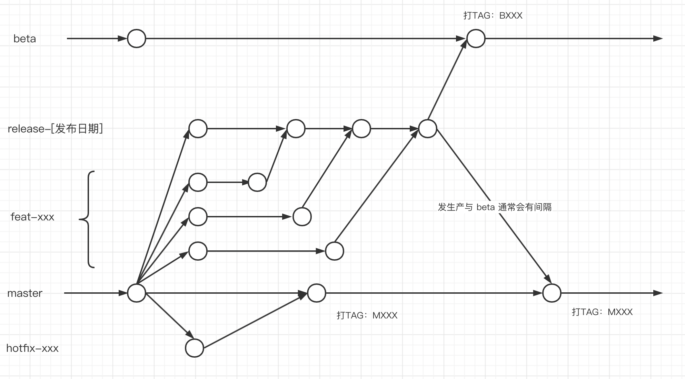

# 202207面试准备

[TOC]

## CSS

### 水平垂直剧中

- text-align 和 line-height
- flex + just-content&algin-items
- absolute + transfrom

### 盒模型

- IE 盒模型

content + padding + border

- 标准盒模型

content

可通过 box-sizing 切换

## JavaScript

### typeof

```JavaScript
typeof 1 === 'number'
typeof '1' === 'string'
typeof true === 'boolean'
typeof null === 'object'   // js 语言的历史 bug
typeof undefined === 'undefined'
typeof {} === 'object'
typeof Symbol(1) === 'symbol'
typeof [] === 'object'  // 无法区分数组
typeof function b(){} === 'function'
typeof /aa/ === 'object' // 无法区分枚举

// es6 中
typeof a;  // Uncaught ReferenceError: a is not defined
let a = 1
```

### instanceof

```JavaScript
[] instanceof Array // true
[] instanceof Object // true
[] instanceof Function // false
// 实例对象（左值）的原型链上是否某个节点 === 构造函数的原型（右值.prototype）
```

模拟实现

```JavaScript
function my_instanceof(obj, target) {
  var proto = Object.getPrototypeOf(obj);
  while(proto) {
    if (proto === target.prototype) {
      return true;
    }
    proto = Object.getPrototypeOf(proto);
  }
  return false;
}
```

### 继承

- 基于原型链的继承

```JavaScript
// 原型继承：直接修改子类构造函数的原型来实现的继承
function A() {}
function B() {}
// 子类构造函数的原型赋值为父类实例对象
B.prototype = new A();

// 缺点：构造函数无法传参
```

- 构造函数继承

```javascript
// 构造函数继承：子类构造函数里调用父类构造函数来初始化
function A() {}
function B() {
  A.call(this);
}

// 缺点：继承不全，只继承了父类实例对象，没有继承父类实例对象本身的继承关系（父类原型链）
```

- 组合继承（原型和构造函数的组合）

```javascript
// 组合继承：基于原型链继承和构造函数继承两种方案的组合
function A() {}
function B() {
  A.call(this);
}
B.prototype = new A();

// 缺点：父类构造函数调用了两遍
```

- 寄生组合继承（寄生在空对象上 + 组合继承）

```JavaScript
// 寄生组合继承：寄生在新的空对象上 + 组合继承
function A() {}
function B() {
  A.call(this);
}
B.prototype = Object.create(A.prototype);

// class 语法的继承通过 babel 转为 es2015 代码时，就是这种继承方案
```

### 什么是闭包和使用场景

> MDN 解释：一个函数和对其周围状态（词法环境）的引用捆绑在一起的组合，称之为闭包

常见用法：函数里返回一个内嵌函数

用途：封装、让外部通过闭包访问到函数内的作用域

注意事项：用不好容易造成内存泄露，因为闭包还有一个所有内嵌函数共享同一个闭包的特性

## 网络

### 浏览器输入 url 到页面显示的过程

整个过程大体上分为这几个步骤：

- url 解析
- DNS 域名解析
- TCP 连接
- HTTP 请求
- 页面渲染
- 断开连接

### dns 域名解析过程

域名解析过程有两种方案：迭代查询、递归查询

DNS 域名服务器分为这几类：

- 根 DNS 服务器
- 顶级 DNS 服务器
- 权威 DNS 服务器
- 本地 DNS 服务器

解析过程：本机向本地 DNS 服务器查询，这过程通常是递归查询；本地 DNS 服务器向根（顶级、权威） DNS 服务器查询，这过程通常是迭代查询

#### 什么是迭代查询

A 找 B，B 不知道，但告诉 A 去找 C，于是 A 去找 C。这种叫做迭代查询

#### 什么是递归查询

A 找 B，B 不知道，但 B 自己去找 C，然后把结果告知 A。这种叫做递归查询

#### 迭代查询和递归查询的优缺点和适用场景

- 递归查询

缺点：查询过程中的节点需要保持连接、也需要缓存结果，因此会相对比较占用资源。因为查询路程越远，越上层的节点，需要缓存的结果越多。而且因为有缓存，可能会被 DNS 劫持攻击。

优点：因为结果缓存下来了，下一次查询就不用再走一遍，速度会快很多

适用场景：适合离本机比较近的节点的查询过程，通常是本机到本地 DNS 服务器的查询过程中

- 迭代查询

优点：不保持连接，也不缓存结果，资源占用少

缺点：可能下一次的查询，还需要再走一遍之前的查询过程，查询速度较慢

适用场景：适合离本机比较远的节点的查询过程，比如在向根 DNS 服务器的查询过程

### tcp 三次握手


#### 为什么需要进行三次握手

因为双方都要确认对方支持双工通信，双工是指发送和接收

- 第一次握手，服务端确认了客服端发送正常
- 第二次握手，客户端确认了服务端发送和接收都正常
- 第三次握手，服务端确认了客户端接收正常

### tcp 为什么是可靠传输

- 通过序列号、确认应答（ACK）、超时重传确保数据有序、完整、可靠
- 通过流量控制来降低发送频率，减少丢包产生
- 通过拥塞控制来适应多变的网络

### tcp 的流量控制

流量控制是指：发送方会根据接收方的处理能力来调整自己的发送数量

具体是每个 ACK 报文上会携带了当前自己滑动窗口的剩余大小，这样发送方获取到这个信息后，就会调整自己发送的报文数量

当接收方滑动窗口剩余为 0 时，发送方会停止发送等待接收方处理，因为担心会有丢包收不到接收方的通知，发送方也会起一个定时任务查看接收方的窗口大小

### tcp 的拥塞控制

拥塞控制是指：发送方会根据当前网络情况，来调整发送数量，以避免让网络更糟糕


包括四个操作：慢启动、拥塞避免、快重传、快恢复

### tcp 的队头阻塞问题

接收方的接收窗口是按顺序接收的，如果前面的报文一直没收到，那么即使收到后面的报文，滑动窗口也不会往前走，这个就是 tcp 的队头阻塞问题

### http 如何解决无状态问题

http 本身是无状态的，解决方案：

- session + Cookie｜token

服务端会维护会话信息（session），只要客户端每次都能把这个 session 信息携带在每一条 http 请求上，服务端就能知道这条 http 请求所属的状态信息

### http 1.0，1.x，2.0，3.0

- 1.x

keep-alive 默认为长连接

增强缓存能力（cache-control）

等等

- 2.0

二进制传输

多路复用：解决 1.x 的连接数量限制导致的阻塞问题

头部压缩：解决重复冗余的头部信息传输问题

服务端推送

- 3.0

基于 udp（quic）：解决 tcp 的队头阻塞问题

#### http 2.0 的多路复用


多路复用：在一个 tcp 连接上，多路 http 消息同时工作

#### 为什么 http 1.x 不能实现多路复用

http 1.x 基于文本分割解析的协议

http 2.0 基于二进制帧的协议

基于文本的协议，传输和解析都只能按顺序进行，无法并行，因为文本本身有序，打乱了后谁也不知道原本顺序是什么了

基于二进制帧的协议，数据都被拆分成一个个帧，每个帧都有编号，解析时按编号组装就能还原数据顺序

### https 的密钥协商过程

概述：用非对称加密协商出一个随机的对称加密密钥来进行对称加密传输

1. 客户端 => 服务端
   - 支持的加密算法列表、密钥长度限制等
2. 服务端 => 客服端
   - 选择的加密算法
   - 数字证书、公钥等
3. 客户端 => 服务端
   - 校验证书
   - 生成随机密钥串并用公钥加密
   - 告知启用随机密钥串进行对称加密了
   - 尝试用随机密钥串加密之前握手的数据
4. 服务端 => 客户端
   - 用私钥解密获取随机密钥串
   - 用随机密钥串解密加密的数据
   - 告知客户端一切试验 ok

#### 对称加密和非对称加密

对称加密指：加密和解密用的是同一个密钥，速度快，但容易泄露

非对称加密：加密通常用公钥，加密通常用私钥，速度慢，但不容易泄露

## 安全

### xss 攻击

跨站脚本攻击，这是一种针对前端漏洞的脚本注入攻击

常见的：反射型攻击、存储型攻击、DOM 型攻击

预防：输入、输出时做过滤、转译处理；内容安全策略（CSP），限制恶意脚本的执行

降低损害程度：cookie 等敏感信息做控制（httpOnly）

实际项目常见：v-html（关键词高亮的需求）

### csrf 攻击

跨站请求伪造攻击，这是一种针对后端漏洞的攻击

利用用户已登录过的信息，伪造成正常用户去获取后端敏感信息

Cookie 的自动发送、Token 的劫持

预防：敏感操作二次确认、验证码

Cookie 的 SameSite

## 浏览器

### 路由导航

两种模式：hash，history

#### hash

形如：`https://xxxx/#/xxx` url 上携带 # 的，称为 hash 模式

`#` 之后的内容变化不会触发请求，服务端就不会去响应，一些代理抓包工具也直接丢弃掉这些内容

这样 nginx 只需要配置域名访问的转发，前端需要自己去实现路由解析以及 404 场景

可通过 hash change 事件监听路由变化

#### history

形如：`https://xxxx/xxx` url 上没有携带 # 的，称为 history 模式

url 发生变化，都会触发新的请求

这样，nginx 需要配置所有的页面导航请求都转发到单页应用到入口文件，这样前端才能接管路由，如：

```nginx
location / {
  try_files $uri $uri/ @router;
  index index.html index.htm;
}

location @router {
  rewrite ^.*$ /index.html break;
}
```

可通过 popstate 事件监听路由变化

#### 如何劫持路由系统

```javascript
// 1. 注册监听路由变化事件
window.addEventListener("hashchange", fn);
window.addEventListener("popstate", fn);

// 2. 重写操作路由的 api
window.history.pushState = fn;
window.history.replaceState = fn;
```

### 常见的存储方式和使用场景

- Cookie：

4k，前端很少需要去用到了，基本是前后端未分离项目后端用来存储身份信息等用途

- SessionStorage

4M，页签级别生命周期，常用于需要在本次使用内根据入口页参数透传至各个页面内做相应服务的场景

- LocalStorage

4M，持久化存储，需要注意容量不够时去做下清理操作，可以自行扩展支持过期机制

- IndexDb

无限制存量，持久化存储，没用过不清楚场景，可能一些前端监控框架采集日志会用到

### 协商缓存和强缓存

强缓存：没有服务端参与，http 1.0 的 Expire，http 1.x 的 cache-control: max-age

协商缓存：服务端根据客户的传参决定缓存是否可用，cache-control: no-cache

if-Modified-Since 和 last-Modified

if-None-Match 和 ETag

#### 通常项目里是怎么设置资源的缓存配置的

- index.html 不设置缓存

- 项目代码打包后的 js，css 资源文件协商缓存
- logo、三方库资源文件等长期不变的，可以设成强缓存

### 跨域问题和解决场景

### 页面渲染流程


### 重排(回流)和重绘

重排(reflow)：也有翻译成回流，指的是当页面布局、几何信息等发生变化时，需要触发重新去计算的过程

重绘(repaint)：指的是绘制元素渲染到页面上展示的计算过程

频繁的重排过程可能会导致性能问题

#### 哪些操作会触发重排和重绘

只要会导致页面的布局或几何信息发生变化的操作：

- 添加、删除、移动元素
- 改变元素大小
- 窗口尺寸变化
- 等等

由于重排的过程是异步队列更新，因此还有一些想要获取实时几何信息的读操作也会触发重排

- offsetTop、offsetLeft、offsetWidth、offsetHeight
- scrollTop、scrollLeft、scrollWidth、scrollHeight
- clientTop、clientLeft、clientWidth、clientHeight
- getComputedStyle()
- getBoundingClientRect()

所以谨慎在循环中，反复调用上述的读操作，应该先缓存结果，再去循环

#### 如何检测是否频繁触发重排和重绘

借助浏览器开发者工具：

- Performance：采集一段时间内的性能数据（包括了重排、重绘），但可能不直观
- Rendering -> Paint flashing：触发重绘的元素会直接通过闪烁标识出来，非常直观

#### 实际项目的优化场景

当界面有元素是有动画时，需要特别注意

尤其是动画的元素在动画过程中，还会影响到其他元素的几何信息时，这个就会导致动画过程中频繁重排

实际例子：[一个在做缩放和移动的动画元素，它的下面是个长列表，动画过程中会导致长列表的位置不断发生变化](https://chenjigeng.github.io/example/share/%E9%81%BF%E5%85%8D%E5%9B%9E%E6%B5%81%E9%87%8D%E7%BB%98/%E5%B0%86%E5%A4%8D%E6%9D%82%E5%8A%A8%E7%94%BB%E6%B5%AE%E5%8A%A8%E5%8C%96.html)

如果开启了 Rendering/Paint flashing 工具，动画过程界面闪烁个不停，这其实意味着非常耗性能，尤其长列表如果还在滑动过程中的话，更卡

优化：让在做动画的元素不要影响到其他元素，简单处理就是绝对定位，将其脱离文档流，这样动画的元素即使它本身大小、位置发生变化，那么顶多重排的只是它自己这个元素，不会影响到其他元素上

### 垃圾回收机制

标记清除法：从根节点出发，标记区分可达与不可达对象

内存碎片处理：划分 from 和 to 两个区域，当 from 清除垃圾后，把剩余的搬移至 to 区

新生区：生存短的对象

老生区：生存长的对象，经过几轮新生区的清除仍旧存活时，升级到老生区

### 内存泄露场景和排查方案

[js 内存泄漏场景、如何监控以及分析](https://juejin.cn/post/6844904048961781774)

#### 常见的内存泄露场景

- 遗忘的定时器
- 使用不当的闭包
- 网络回调

#### 怎么排查

借助浏览器的开发者工具：

- Memory -> Heap Snapshop：抓取内存快照（多抓几次做对比）
- Memory -> Alloction instrumentation on timeline：抓取一段时间，内存分配情况
- Memory -> Alloction sampling：抓取一段时间内，触发内存分配的函数情况

## 手写

### 手写 apply

```javascript
// 改变 this, 参数处理
function apply2(that, args) {
  if (that == null) {
    that = window;
  }
  if (typeof that !== 'object') {
    that = Object(that);
  }
  const fn = this;
  that.__fn__ = fn;
  const res = that.__fn__(...args);
  delete that.__fn__;
  return res;
}
```

### 手写 call

```javascript
// 改变 this，参数处理
function call2(that, ...args) {
  if (that == null) {
    that = window;
  }
  if (typeof that !== 'object') {
    that = Object(that);
  }
  const fn = this;
  that.__fn__ = fn;
  const res = that.__fn__(...args);
  delete that.__fn__;
  return res;
}
```

### 手写 bind

```JavaScript
// 改变 this，返回新函数，处理新旧参数，区分被当作构造函数使用场景
function bind2(that, ...args) {
  const fn = this;
  return function F(...newArgs) {
    return this instanceof F ? new fn(...args, ...newArgs) : fn.apply(that, [...args, ...newArgs]);
  }
}
```

### 手写 new

```javascript
// 用 F 的原型创建新对象，作为 F 的 this 去调用 F
function new2(F, ...args) {
  const o = Object.create(F.prototype);
  const res = F.apply(o, args);
  return res ? res : o;
}
```

### 手写 debounce

```javascript
// 短时间内高频调用的函数只响应最后一次
function debounce(fn, delay = 0) {
  let timer = null;
  return function(...args) {
    if (timer) {
      clearTimeout(timer);
    }
    timer = setTimeout(() => {
    	fn(...args);
      timer = null;
    }, delay)
  }
}
```

### 手写 throttle

```javascript
// 短时间内高频调用的函数会按一定的频率响应
function throttle(fn, delay = 0) {
  let flag = null;
  return function(...args) {
    if (!flag) {
      flag = true;
      fn(...args);
      setTimeout(() => {
        flag = false;
      }, delay);
    }
  }
}
```

### 手写 promise（简易版）

```javascript
// 三种状态（pending, fulfilled, rejected）
// pending 时缓存回调，否则直接执行
function MyPromise(fn) {
  this.fulfilledCallbacks = [];
  this.rejectedCallbacks = [];
  this.value = '';
  this.state = 'pending';
  fn((value) => {
    this.value = value;
    this.state = 'fulfilled';
    this.fulfilledCallbacks.forEach(f => f(value));
  }, (err) => {
    this.value = err;
    this.state = 'rejected';
    this.rejectedCallbacks.forEach(f => f(err));
  });
}

MyPromise.prototype.then = function(onFulfilled = (v) => v, onRejected = e => e) {
  if (this.state === 'pending') {
    this.fulfilledCallbacks.push(onFulfilled);
    this.rejectedCallbacks.push(onRejected);
  } else if (this.state === 'fulfilled') {
    this.value = this.onFulfilled(this.value);
  } else if (this.state === 'rejected') {
    this.value = this.onRejected(this.value);
  }
  return this;
}
```

### 手写深拷贝

```javascript
// 区分数组和对象、注意循环引用、只拷贝自身属性、for-in
function deepClone(obj, map = new Map()) {
  if (typeof obj !== 'object') {
    return obj;
  }
  if (map[obj]) {
    return map[obj];
  }
  let res = {};
  if (Array.isArray(obj)) {
    res = [];
  }
  map[obj] = res;
  for(const key in obj) {
    if (obj.hasOwnerProperty(key)) {
     	res[key] = deepClone(obj[key], map);
    }
  }
  return res;
}
```

### 手写 proxy 实现数据劫持

```javascript
// Proxy, Relect，三个参数：target, property, receiver
function proxy2(obj) {
  return new Proxy(obj, {
    get: function(target, property, receiver) {
      // ...
      return Reflect.get(target, property, receiver);
    },
    set: function(target, property, value, receiver) {
      // ...
      return Refect.set(target, property, value, receiver);
    }
  });
}
```

## 算法

[LeetCode](../%E7%AE%97%E6%B3%95/README.md)

### 快排

```javascript
// 找基准元素，小于的放一边，大于等于的放一边。递归处理
function quickSort(arr) {
    if (arr.length <= 1) {
        return arr;
    }
    var pivotIndex = Math.floot(arr.length / 2);
    var pivot = arr.splice(pivotIndex, 1)[0];
    var left = [];
    var right = [];
    for (var i = 0; i < arr.length; i++) {
        if (arr[i] < pivot) {
            left.push(arr[i]);
        } else {
            right.push(arr[i]);
        }
    }
    return quickSort(left).concat([pivot], quickSort(right));
}

```

## 框架

### vue

#### 双向绑定原理

##### 概述

通过数据劫持，在 getter 时收集依赖，在 setter 时派发更新，更新时通过虚拟树的 diff 算法，找出组件需要更新的那部分 dom 元素

##### 具体实现

一个  vue 组件里的响应式的数据基本上有这几种： props，computed，data，watch

其中，watch 数据的依赖是在组件 create 创建阶段就会被收集起来

其他的数据，只有当组件在 mounted 挂载时，触发了 render 函数，然后模板里有使用到相应数据，触发 getter，才会收集依赖

之所以会有这种区别，是因为，vue 内部的监听器是有两种类型的

一种是组件渲染的 watcher，这个是 vue 内部在挂载组件时，会自动创建的，一个组件只会有一个组件渲染 watcher（vm._wathcer 变量），这个 wathcer 是用来收集该组件监听的需要触发更新视图的这些数据依赖，没在模板上使用的数据是不会被作为依赖收集起来监听的

另一种是开发人员自行创建的监听器，比如在 watch 里声明的，比如通过全局函数 $watch

##### getter 时收集依赖收集的都是什么

vue 在创建响应式数据对象时，会对每个属性用闭包创建了一个 Dep 对象数据来存储依赖信息，也就是说，一个属性就是一个依赖，Watcher 收集的依赖就是收集每个属性的 Dep

然后这个 Dep 里会维护着监听当前这个属性的所有 watcher

当这个属性被修改时，触发了 setter，就会通过调用 Dep 的 update 方法，通知所有 watcher 来更新

##### setter 去更新视图是怎么做的

当响应式数据的属性被修改时，触发了 setter，内部会通过 Dep 的 update 方法通知所有 watcher 进行更新，不同类型的 watcher 的更新行为有所不同

对于开发人员创建的 watcher，在创建时，就需要传入对应的回调函数，所以怎么响应由开发人员自行实现，比如 watch 的 handler 函数

对于组件渲染 watcher，它在创建时绑定的回调行为是：

```javascript
updateComponent = () => {
    vm._update(vm._render(), hydrating)
}
```

所以当数据更新时，会先调用 render 函数生成新的虚拟 Dom，然后 update 函数里，会通过 diff 算法比对新旧两颗虚拟 Dom 的差异，来生成那些视图更新操作

##### diff 算法

patch 过程主要分三种场景：

- 旧节点是真实 Dom，新节点是虚拟 Dom，表示首次渲染
- 旧节点是虚拟 Dom，新节点为空，表示销毁
- 新旧节点都是虚拟 Dom，开始 diff
  - 同层比较，深度优先
    - 节点相同的判断逻辑：key 相等且 tag 相等以及其他一些判断
    - 同层两数组通过头尾指针来进行比较
    - 等等
  - 新旧都有子节点的话，递归
  - 旧无子节点，新有，插入子节点
  - 旧有子节点，新无，删除子节点

##### 更新时是如何保证父组件重新渲染不导致子级重新渲染的

每个组件都有自己的一个 watcher，绑定了自己组件的 update 函数，因此当 setter 时，Dep 去通知 Watcher 更新，已经可以直接定位到具体需要更新的组件了

但至于是更新组件的哪一块 dom 元素，就还需要通过虚拟 Dom 的 diff 算法去计算得出

##### 异步更新队列是什么

为了避免重复的相同更新操作以及进行批量的 dom 操作，vue 内部采用的是异步更新队列方案

setter 调用时，依赖 Dep 去通知监听者 Watcher 进行更新时`watcher.update()`，Watcher 只是把当前更新操作入列操作而已 `queueWathcer(this)` ，并没有实际去更新，入列时还可以过滤掉重复的 watcher，然后通知下一帧时去清空队列 `nextTick(flushSchedulerQueue)`，清空队列时，会将队列里的 wathcer 取出来，调用它的 run 方法执行，run 方法又会去调用到内部的 get 方法来取数，get 方法里会去调用创建 watcher 时传进来的回调函数

##### $nextTick 是什么

异步更新队列的下一帧，因为 vue 的视图更新操作是通过异步更新队列方案的，具体实现异步的方式是通过多种方案降级，优先 Promise，ie 下会尝试 mutationobservable，继续尝试 setImmediate，实在不行，最后默认用 setTimeout

流程上，nextTick 会将回调函数 cb 放入一个全局的回调函数队列数组里 `callbacks.push(cb)`，然后调用 timerFunc 来触发清空队列

timerFunc 内部会根据浏览器支持清空来决定是使用 promise 还是 setTimeout 实现异步任务，异步任务回调里去清空回调函数队列 `flushCallbacks`

#### 3.0 为什么会推组合式 API

#### computed、methods、watch 区别

#### computed 计算属性的依赖收集是怎么处理的

### vue 初始化流程

1. 挂载 vue 实例对象的内部变量和函数
2. 调用 **beforeCreate** 生命周期
3. 生成响应式数据
   - props 数据直接调用 defineReactive 处理
   - computed ?
   - watch 数据直接创建一个 watcher 来监听
   - data 会通过 Observer 遍历属性来处理
4. 调用 **created** 生命周期
5. 如果有 $el，则自动调用 $mount 来挂载组件
6. template 模板编译生成 render 函数
7. 调用 **beforeMount** 生命周期
8. 创建组件渲染 watcher，绑定并调用更新视图的 _update 方法
9. 调用 render 函数生成虚拟树
10. 通过 diff 算法更新视图
11. 调用 **mounted** 生命周期

### Vue.$set 内部原理

1. 如果是数组，通过 splice 来修改数据
2. 如果是对象
   1. 如果 key 值已存在，执行简单的赋值行为
   2. 否则通过 Object.definedProperty 劫持数据

### Vue 内部对 Object.definxxx 局限所做的支持

数组方面

- 重写相关 api

动态属性方面

- $set

### vite

#### 原理是什么

#### 从 webpack 迁移到 vite，需要对项目做哪些改造

#### 迁移过程有哪些坑点

#### 用 vite 开发时，为什么首页打开页面会需要等待比较长的时间

### 微前端

#### 什么是微前端，主要解决什么问题

#### qiankun 框架做了什么

##### qiankun 是怎么集成（加载）子应用的

##### qiankun 是怎么隔离 css 的

##### 分别讲讲 qiankun 隔离 js 的两种方案：快照、代理

##### localStorage 冲突了怎么隔离、iconfont 呢

#### single-spa 框架做了什么

##### 劫持路由系统

简单说就是：single-spa 劫持了路由系统相关 api。只有 single-spa 才是真正监听了系统的路由事件，这之后不管是谁再去监听路由事件，还是操作路由 api，实际上，都经过 single-spa 来控制

```javascript
// 1. 注册监听路由变化事件
window.addEventListener("hashchange", urlReroute);
window.addEventListener("popstate", urlReroute);

// 2. 重写原生事件监听，如果发现是要监听 hashchange|popstate 事件，那么不让它监听，但把它的回调事件缓存起来
window.addEventListener = function (eventName, fn) {
    if (typeof fn === "function") {
      // 如果是监听 popstate｜hashchange 事件，并且这个回调事件没有注册过，那么就放入缓存里
      //...
    }
    return originalAddEventListener.apply(this, arguments);
};
window.removeEventListener = function (eventName, listenerFn) {}

// 3. 重写操作路由的 api
window.history.pushState = patchedUpdateState();
window.history.replaceState = patchedUpdateState();
```

### 低代码

#### 什么是低代码框架，主要解决什么问题

其实就是把原本用代码来描述界面，转换成，用元数据来描述界面

因此低代码框架的核心之一就是制定元数据的各种规则，框架内部就是围绕着元数据去做各种工作，比如解析等

通过用元数据来描述界面，这样就可以尽可能少的依赖代码实现，只需要修改相应配置就能兑现需求，达到快速交付、快速发版的效果

#### 低代码框架的架构

有两种级别的架构，一种是应用级的低代码框架，一种是页面级的低代码框架

这里以页面级低代码框架为例

。。。

#### 如何设计元数据的规则

规则应该尽可能通用，基于这条原则，基本上可以分为两种：通用规则，特性规则

通用规则：所有组件都有的规则，比如宽度、事件绑定等

特性规则：一些组件特有的规则，比如多选框组是否支持多选

设计规则的角度可以从两大层面出发：ui 渲染方面，组件联动交互方面

ui 渲染方面，主要就是内置组件的积累了，实现上一一映射渲染就行了，而组件的封装上，主要是容器类组件比较复杂

组件联动方面，主要就是数据源取数、事件监听响应、条件表达式

#### 表单数据如何建模

表单页面需要对表单数据模型进行建模

两种思路：一种是由使用人员自己预先实现完，传进来，框架直接使用

一种则是框架内部自动建模，那自然就是基于表单组件绑定的表单字段 key 值来自动建模了

#### 如何扩展低代码框架的自定义能力

低代码框架的核心之一在于是否拥有自定义能力，让使用者自定义实现的能力

自定义组件的实现：具名作用域插槽实现

自定义组件联动交互实现：函数库的方案

#### 设计一个低代码平台使用的组件需要考虑什么

维护人员的维护成本、扩展能力

使用人员的上手成本，自定义能力

### 前端监控系统

#### 监控系统的架构图

#### 日志如何收集，如何存储，如何上报

#### 监控平台的错误日志如何跟源码定位

## 工程

### 统一规范

1. 借助 `.eslintrc.js` `.prettierrc.js` 让 vs code 统一代码风格
2. 借助 pre-commit 来自动检测提交的代码规范
3. 走 mr 流程来进行 code review

### git 分支模型



### 什么是 Dev-Ops

Dev-Ops：Development 和 Operations 的组合词

通俗解释就是：开发运维一体化

要实现这个，需要流程 + 系列平台工具辅助

### webpack

webpack 是一个打包工具，通过指定入口文件作为输入，内部经过依赖图生成、Loader、Plugin 等转换为 chunk 输出指定文件

通常，从一个入口地址起，会把所有代码都打包进一个 chunk 里，默认输出 main.js 文件，但如果用到懒加载 `import()` 或者一些 plugin 插件，会额外输出其他 chunk 文件，没有配置的话，默认会是一个 id 命名，可以通过配置修改，也可以通过魔法注释 `/* webpackChunkName: "xxx" */` 来修改

#### 工作流程

1. 根据配置文件，进行**初始化**，并**挂载插件**
2. 从指定入口文件开始，调用匹配的 **Loader** 对其进行编译，并在合适时机通知 **Plugin** 执行，最后对获得的依赖模块重复此步骤
3. 将编译后的代码生成一个个 chunk，并输出文件

#### loader 和 plugins

- loader

  用于处理指定文件的转换过程，链式传递，输入输出均为字符串

- plugin

  用于扩展 loader 的局限，监听整个打包过程，在相应生命周期去实现所需的工作

#### 常用的 plugins

 #### 常用的 loader 

#### 打包拆分怎么做

webpack 拆分 chunk 有三种场景：

- 多 entry 入口配置
- 代码里模块以动态方式引入 `import(xxx)`
- plugin 插件（splitChunks：抽离公共代码）

注：可以打包时，可以使用 webpack-bundle-analyzer 插件来查看打包结果

splictChunks 有几种工作模式，由 chunks 配置控制:

```
chunks: 'initial | all | async(默认)'
```

async：默认值，工作模式就是会将动态引入的模块生成单独的 chunk，如果有公用，刚好复用

initial：这个工作模式是，除了 async 模式的功能外，对于静态引入的模块，如果有公用时，才会提取出来。但静态和动态的不会共通

all：这个是推荐的模式，除了 async 模式的功能外，对于静态引入的模块，如果有公用时，才会提取出来，而且静态和动态的共通的

#### 执行 npm run xxx 发生了什么

1. package.json 文件里的 script 块找到相应命令执行

2. 接着去 node_modules 目录下的 .bin 目录找第一步命令的可执行文件来执行

   node_modules 目录下的 .bin 目录会存放着 `npm install xxx` 安装指定包时，该包的 bin 目录下的可执行文件

   可以简单理解成这里是局部变量环境

   这也是为什么有时直接执行 script 块里的命令时，会报系统找不到指定命令的错误，但执行 npm run xxx 时却能正常运行

3. 如果第 2 步没有找到，那么会去全局的 node_modules/.bin 目录下寻找

   这里就对应着那些通过 `npm install -g xxx` 安装到全局的包

4. 如果第 3 步也没有找到，则会去系统变量里寻找是否有这个命令

#### 创建和发布 npm 组件包流程

- 创建项目仓库
- 修改 package.json 配置（主要 name, version, main）
- cnpm 命令登录、发布

## 综合

### 自我介绍

#### 一二面

94 年的，17 年在福州大学、本科、计算机专业毕业，毕业至今从事过两家公司，一个是在厦门，一个是在深圳，目前人在深圳，（不过老家在泉州）（目前是离职状态）。

从事的都是 2B 的产品，产品形态涉及到了多端，web 后台、公众号、企业微信、跨平台的 app 都有涉及到

技术栈方面，主要是 vue 2 的框架，也自研过一些提效插件或工具

（最近一年当过新人入职导师，带过敏捷团队）

##### 提问

- 能简单介绍下这次招聘的前端岗位所需要负责的产品形态和业务吗
- 前端团队的规模情况呢，技术栈方面呢

#### 三面

94 年的，17 年在福州大学、本科、计算机专业毕业，毕业至今从事过两家公司，一个是在厦门，一个是在深圳，目前人在深圳，不过老家在泉州，目前是离职状态，预计7月底，8月初回老家。

从事的都是 2B 的产品

平时开发会比较在意效率和规范问题

所以也开发过一些提效插件或工具，然后也制定了一些 review 之类的规范

最近一年当过新人入职导师，带过敏捷团队

##### 提问

- 能简单说下，你们对这个岗位的应聘者的要求或者期待是什么吗，比如说，你们希望应聘者具有哪些能力，能有哪些成果，或者有哪些挑战，能收获哪些成长呢

### 封装组件时需要考虑什么

单一职责，可扩展、抽象化以便尽可能的通用

### 做成组件库时需要考虑什么

要求跟标准需要提升，比如需要单元测试用例，需要负责任 review 之类的

如何发版、更新、维护

支持按需引入，因此打包工具可以借助 rollup 来多文件打包

样式抽离，以便使用者进行覆盖

是否需要推广，如何推广、如何收集反馈，响应 bug

组件官网

### 如何排查线上问题

思路：复现 ->  排查定位 -> 解决

只要能复现的问题，其实都不是问题

辅助复现：

- 前端监控系统（采集用户行为日志，来复盘用户操作）
- 生成环境如何调试（走代理）

假如已经能复现了，但代码还无法精确定位到哪一块时

排查定位：

- 二分回退法（先排除是历史问题，还是近期引入问题）
- 二分代码调试法

#### 举个实际例子

（实例应该没什么好讲的吧，为何对实例感兴趣呢）

因为很多棘手 bug，排查到最后发生大多都是因为业务逻辑问题导致的，业务场景太复杂，对于这类 bug，没有业务背景，讲不清楚的，对着代码都不一定能讲清楚

如果非要举实例，那只是举一些非业务逻辑类的棘手 bug 了，比如兼容性

我们有个 h5，在浏览器，在微信上，页面返回的行为都是正常的，但偏偏在企业微信上，需要连续返回两次才能正常退出页面（只有首页是这样）

这个问题毫无头绪，幸好能复现，那就是二分法了，一块一块代码的去注释，去打日志，来排查

最后发现是某个模块拦截了路由，使用了 next(to) 方式重载了当前页，因为它做了一些异步处理

然后就是去官方找解释，说是 next 只要有带参，都会有新的路由入栈，但我们路由是 hash 模式的，理论上路由一样，就不会产生新栈，而且测试效果也是这样的，偏偏就是在企业微信上时才会出现

最后，还是没有找到根因，只能怀疑是兼容性问题了，企业微信的浏览器内核可能不一样导致的，所以代码换种写法就好了 

### 带新人最重要的是什么

分阶段，前期引导新人快速融入团队、上手项目；后期协助新人规划成长计划

性格内向的，可以每次迭代分配任务时，安排与不同的同事协助的任务，这样可以帮助快速跟同事熟络

项目上手方面，一方面是沉淀好相应文档，二是安排各项目任务，让他在实战中去学习熟悉项目

### 带团队最重要的是什么

全局观，要有全局的角度去把控进度、把控风险

比如每次迭代需求，不能只了解自己负责的，至少需要全局了解本次迭代所有需求，以便提前识别本次是否有比较难的需求，比较可能有风险的需求，好提前关注风险

沟通协作能力，如果遇到需要跨组、跨部门协作的需求，需求知道去找谁沟通、协作

风险把控，每日的晨会需要跟进进度，识别是否有风险，有问题及时暴露，再看怎么去解决，是要协调资源，还是向上反馈

### 讲讲你做的那个跨平台离线 app 项目

**跨平台原理**：原生 app 端通过启用一个 webview 来运行 h5 代码，达到跨平台的效果

其中，通过 Cordova 插件来作为中间层，抹平不同平台的差异

**离线 app 原理**： h5 代码并不是在线部署的，而是直接集成到 app 里面，代码下载到用户手机设备上再去本地运行的

因此即使无网络，程序仍旧可运行，所以叫它离线 app

既然代码是在用户设备本地，因此需要有一种发版、更新机制来将新版代码下发到用户设备上

所以要自己实现一套热更新机制，其中比较重要的就是版本号，来判断是否需要更新，这里还需要依赖于 app 原生文件操作能力

另外，虽然代码离线了，但程序的功能要想也支持无网络运行，意味着数据不能依赖于接口调用

所以前端项目里还需要类似后端一样，加入数据库机制、数据库操作层、业务逻辑层来处理这些数据

另外，用户操作过程中，产生的业务数据也需要有一种机制来上传到服务端，比如增量表机制

同时，服务端到新数据也需要有一种机制，同步到用户本地数据上，可根据数据类型决定是增量下载更新还是全量下载覆盖更新

### 讲讲你微前端方案的重构

**背景**：我们有一个 app 产品，这个 app 项目里有多条产品线，由不同团队维护。大家的发版节奏、管理方式等都不太一样，但项目代码又都是耦合在一起的，导致经常容易出问题，你影响我，我影响你。于是才进行了微前端来解藕

微前端的特点就是各个子产品可以独立开发、独立发版，但对外又是一个统一的产品形态

对于 SPA 的微前端框架，比较热门的就是蚂蚁金服的 qiankun 框架，它的好处之一就是开箱即用，但对于业务复杂的场景来说，这个也是它的缺点，因为能够定制化途径太少

就比如 qiankun 内部是用了 import-html-entry 框架来加载子应用，但这个框架就不适用于加载离线代码

当然，我们没有选择采用 qinkkun 框架不止这一个原因，我们最后选择基于 single-spa 来自研

Single-spa 框架是微前端架构的基础，它内部其实就做了一件事：管理子应用

- 具体实现是：劫持整个路由系统，然后定义了一系列子应用的生命周期，根据路由来激活、卸载不同子应用

但 single-spa 不实现子应用的加载，也不实现子应用间的隔离，这些需要自己去实现

它只要求子应用需要暴露几个生命周期函数，包含挂载的方法，这其实也是微前端之所以能够支持框架无关特性的原因，因为 single-spa 只负责激活了子应用需要挂载时，去调用子应用提供的方法，至于怎么挂载，不同框架就自己各自去实现

#### 你们这个微前端自研过程你有参与吗，是什么角色

我没有参与，我进公司的时候就已经落地成功在使用了

不过我对它挺感兴趣的，于是去看了它的实现源码，找了当时参与的同事去了解他们当初设计时的考虑因素

最后自己梳理出来了这些

### 设计模式五大原则

- 开闭原则
- 单一职责
- 里式替换原则
- 依赖倒置原则
- 迪米特法则(最少认识)

### app 跨平台框架

#### Cordova + webview

原理：Cordova 作为中间层抹平不同平台的差异，向 js 提供 app 原生硬件能力，webview 作为渲染解析引擎，运行前端代码

缺点：

- 需要有专门的原生开发团队来提供 app 原生的打包能力，Cordova 插件的能力（或者前端自己去找社区的开源库）
- Webivew 局限性

优点：

- 原生开发团队与前端业务团队各司其职，原生开发团队专注基建开发，业务交由前端开发
- 一套前端代码，多端运行
- 代码支持热更新

#### flutter

原理：单独一套跨平台 ui 框架，单独搞得 ui 组件渲染

缺点：

- 需要依赖原生开发团队
- 跨平台语言非前端系，需要学习成本

优点：

- 渲染快，性能好

#### React Native

原理：react 作为中间层，通过虚拟树 dom 来把 dom 组件视图映射到不同平台的原生组件系统上，来实现视图渲染的跨平台，另外通过在原生层面启用一个 js 运行环境来响应逻辑，并通过 `NativeModules` 来提供原生硬件能力

缺点：

- 需要原生开发团队来提供 app 打包能力、硬件能力

优点：

- 

#### uni-app

应该说 uni-app 是跨平台生态框架，因为它包含了运行时的跨平台能力，开发时的跨平台能力、发布能力等

优点：

- 甚至不需要原生团队，只依赖前端团队即可完成跨平台 app 的开发、发布

### 基建封装

#### 如何封装请求库

第一，肯定不是基于 xmlHttpRequest 封装，能不重复造轮子就不造轮子了，所以可以选择基于 axios 封装

第二，封装的目的自然是简化业务层的使用，抽离重复的代码封装

- 自动请求参数的封装，如 token，账户等
- 通用的异常处理，如打印日志，弹 toast 等

第三，结合项目背景的封装

- 域名配置方案（前后端分离、前后端未分离）

第四，结合业务的封装

- 请求失败的重试
- token 过期的重定向

#### 如何封装 jssdk

封装的目的在于简化业务层的使用，业务层直接使用原生 jssdk 麻烦的点有：

- Jssdk 的鉴权
- 埋点日志

##### jssdk 的鉴权

jssdk 要求页面发生变化都需要重新鉴权，鉴权需要的数据来自于后端，所以前端可以通过监听路由变化事件，比如在 afterEach 事件里，根据当前页面路由是否配置了需要使用 jssdk 的情况，内部自动发请求跟后端交互获取到数据去进行鉴权

##### 埋点日志

使用 proxy 和 Reflect 劫持 jssdk 的 api 访问情况，来进行埋点日志
