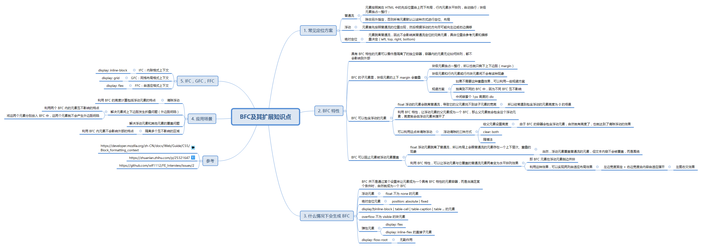

# 题目：介绍下 BFC 及其应用

https://github.com/Advanced-Frontend/Daily-Interview-Question/issues/59

BFC：(Block Formatting Context 块级格式化上下文)

# 参考

- [10 分钟理解 BFC 原理](https://zhuanlan.zhihu.com/p/25321647)

- [块格式化上下文](https://developer.mozilla.org/zh-CN/docs/Web/Guide/CSS/Block_formatting_context)

- [BFC及其原理解析](https://github.com/wlf1112/FE_Interview/issues/2)

# 笔记

清楚 BFC 的一些特性之后，如果有自己踩过一些坑，那就可以体会到 BFC 的这些特性是多么的有用，刚好可以解决某些场景问题。

### 特性

1. BFC 元素可以看作是隔离了的独立容器，它的元素无论如何排列，都不会影响外部（可以利用这点解决外边距塌陷）
2. BFC 元素的高度计算包括其内的浮动元素（刚好利用这点可以清除浮动以及让其内的其他元素高度跟浮动元素高度能有所关联）
3. BFC 可以阻止元素被浮动元素覆盖

了解了 BFC 特性，踩过一些坑，自然就想记录一些应用场景，都可以拿它来干嘛。（关于 BFC 其他知识点内容移步脑图阅读）

### 应用场景

#### 解决块级元素的外边距坍陷现象

块级元素之间默认会发现外边距塌陷，即上下的 margin 重叠的现象，如：

```html
<div style="margin: 20px;width: 20px; height: 20px;background-color: orange;"></div>
<div style="margin: 20px;width: 20px; height: 20px;background-color: orange;"></div>
```

  

这时候，即使你把这两个 div 再分别套个外层，也不起作用：

```html
<div><div style="margin: 20px;width: 20px; height: 20px;background-color: orange;"></div></div>
<div><div style="margin: 20px;width: 20px; height: 20px;background-color: orange;"></div></div>
```

除非手动为外层 div 设置 border，这样，内层 div 的 margin 就是针对于外层 border，效果上就类似于 padding，此时也就不会有外边距塌陷现象，但引入的副作用就是，多了 border，这可能并不是想要的效果。

那么，要避免出现这些塌陷的现象，就可以利用 BFC 的特性：两个 BFC 是相互独立区域，其内的元素互不影响。

也就是把外层包裹的 div 设置成 BFC，那么它们的子元素的 margin 就不会互相影响到了，如：

```html
<div style="overflow: hidden;"><div style="margin: 20px;width: 20px; height: 20px;background-color: orange;"></div></div>
<div style="display: flow-root;"><div style="margin: 20px;width: 20px; height: 20px;background-color: orange;"></div></div>
```

  

overflow: hidden 和 diaplay: flow-root 都可以让元素变成一个 BFC，所以，以后看到别人代码里，某个 div 内容明显不会溢出，但却又设置了 overflow: hidden 属性，不要意外，他可能就只是想利用 BFC 特性而已，并不是真的想控制溢出效果。

至于清除浮动，以及让元素不会被浮动元素覆盖的场景，因为没这方面需求，暂时没遇到，就不记录了，清楚有这些应用场景即可。

### 疑问

有个疑问一直不理解，看了很多讲 BFC 的文章，都说，BFC 的容器，就是一个隔离开的容器，无论其内部元素如何翻江倒海，都影响不到外部。

既然这样，那看下面个例子：

```html
<div style="display: inline-block;width: 300px;">    
    <p>dsfaf</p>    
    <p>dsfaf</p>    
    <p>dsfaf</p>
</div>
<div style="display: inline-block;width: 300px;">    
    <span>fsdfdsfds</span>
</div>
<div style="display: inline-block;width: 300px;">fsdfsdf</div>
```

display: inline-block 也会让元素成为一个 BFC。既然这样，那么上面代码的效果，应该就是在一行里划分成三个列，每列宽度 300 px。按道理，每一列的区域都是一个隔离区域，其内的元素如何排列都不会影响其他列的才对。

看看效果：

  

第一列里有三个 p 元素，划分成三行。第二列里元素开始定位时，就会受到第一列里元素的影响，因为基线问题，直接就是从最后一行开始了。第三列同理。

**为什么会这样？不是说 BFC 是一个隔离区域，其内的元素不管如何翻江倒海，都不会影响外部么？**

这是我比较不理解的一点。

当然，解决这种现象方式很多，要么用 float 来实现三列布局，要么把三个 div 放在 display: flex 容器内，最后的效果：

  

### 知识点脑图

  